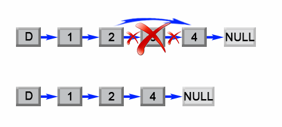
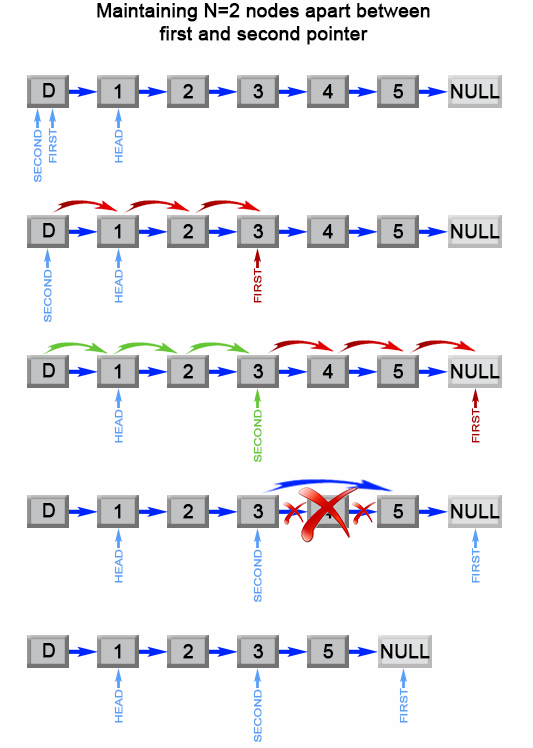

# Remove Nth node From End of List (Medium)

## Description

Given the head of a linked list, remove the nth node from the end of the list and return its head.

**Example 1:**


**Input**: head = [1,2,3,4,5], n = 2
**Output**: [1,2,3,5]

**Example 2:**

**Input**: head = [1], n = 1
**Output**: []

**Example 3:**

**Input**: head = [1,2], n = 1
**Output**: [1]

**Constraints:**

The number of nodes in the list is $sz$.  
$1 \leq sz \leq 30$  
$0 \leq Node.val \leq 100$  
$1 \leq n \leq sz$  

**Follow up**: Could you do this in one pass?

## Solution

### Approach 1: Two pass algorithm

#### Intuition

We notice that the problem could be simply reduced to another one : Remove the $(L - n + 1)$th node from the beginning in the list , where $L$ is the list length. This problem is easy to solve once we found list length $L$.

#### Algorithm

First we will add an auxiliary "dummy" node, which points to the list head. The "dummy" node is used to simplify some corner cases such as a list with only one node, or removing the head of the list. On the first pass, we find the list length $L$. Then we set a pointer to the dummy node and start to move it through the list till it comes to the $(L - n)$th node. We relink next pointer of the $(L - n)$th node to the $(L - n + 2)$th node and we are done.



#### Implementation in Java

```java
public ListNode removeNthFromEnd(ListNode head, int n) {
    ListNode dummy = new ListNode(0);
    dummy.next = head;
    int length  = 0;
    ListNode first = head;
    while (first != null) {
        length++;
        first = first.next;
    }
    length -= n;
    first = dummy;
    while (length > 0) {
        length--;
        first = first.next;
    }
    first.next = first.next.next;
    return dummy.next;
}
```

#### Complexity Analysis

Time complexity : $O(L)$.

The algorithm makes two traversal of the list, first to calculate list length LL and second to find the $(L - n)$th node. There are $2L-n$ operations and time complexity is $O(L)$.

Space complexity : $O(1)$.

We only used constant extra space.

### Approach 2: One pass algorithm

#### Algorithm

The above algorithm could be optimized to one pass. Instead of one pointer, we could use two pointers. The first pointer advances the list by $n+1$ steps from the beginning, while the second pointer starts from the beginning of the list. Now, both pointers are exactly separated by nn nodes apart. We maintain this constant gap by advancing both pointers together until the first pointer arrives past the last node. The second pointer will be pointing at the n'nth node counting from the last. We relink the next pointer of the node referenced by the second pointer to point to the node's next next node.



#### Implementation in Java

```java
public ListNode removeNthFromEnd(ListNode head, int n) {
    ListNode dummy = new ListNode(0);
    dummy.next = head;
    ListNode first = dummy;
    ListNode second = dummy;
    // Advances first pointer so that the gap between first and second is n nodes apart
    for (int i = 1; i <= n + 1; i++) {
        first = first.next;
    }
    // Move first to the end, maintaining the gap
    while (first != null) {
        first = first.next;
        second = second.next;
    }
    second.next = second.next.next;
    return dummy.next;
}
```

#### Complexity Analysis

Time complexity : $O(L)$.

The algorithm makes one traversal of the list of LL nodes. Therefore time complexity is $O(L)$.

Space complexity : $O(1)$.

We only used constant extra space.
