# Binary Tree Preorder Traversal (Easy)

## Description

Given the `root` of a binary tree, return \_the preorder traversal of its nodes' valuesj.

**Example 1:**


**Input:** root = [1,null,2,3]  
**Output:** [1,2,3]

**Example 2:**

**Input:** root = []  
**Output:** []

Example 3:

**Input:** root = [1]  
**Output:** [1]

**Example 4:**

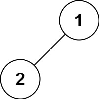

**Input:** root = [1,2]  
**Output:** [1,2]

**Example 5:**


**Input:** root = [1,null,2]  
**Output:** [1,2]

**Constraints:**

The number of nodes in the tree is in the range `[0, 100]`.
$-100 \leq Node.val \leq 100$

**Follow up:** Recursive solution is trivial, could you do it iteratively?

## Solution

### How to traverse the tree

There are two general strategies to traverse a tree:

- _Breadth First Search_ (`BFS`)

We scan through the tree level by level, following the order of height, from top to bottom. The nodes on higher level would be visited before the ones with lower levels.

- _Depth First Search_ (`DFS`)

In this strategy, we adopt the `depth` as the priority, so that one would start from a root and reach all the way down to certain leaf, and then back to root to reach another branch.

The DFS strategy can further be distinguished as `preorder`, `inorder`, and `postorder` depending on the relative order among the root node, left node and right node.

On the following figure the nodes are numerated in the order you visit them, please follow `1-2-3-4-5` to compare different strategies.

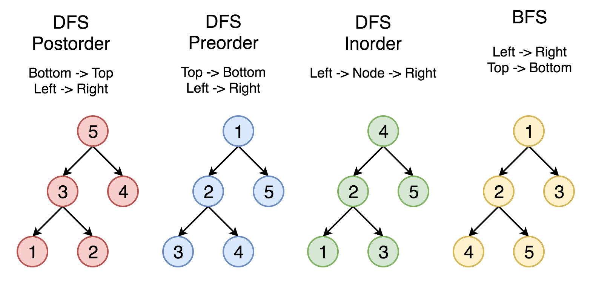

Here the problem is to implement preorder traversal using iterations.

### Approach 1: Iterations

#### Algorithm

First of all, here is the definition of the TreeNode which we would use in the following implementation.

```python
class TreeNode(object):
    """ Definition of a binary tree node."""
    def __init__(self, x):
        self.val = x
        self.left = None
        self.right = None
```

Let's start from the root and then at each iteration pop the current node out of the stack and push its child nodes. In the implemented strategy we push nodes into output list following the order `Top->Bottom` and `Left->Right`, that naturally reproduces preorder traversal.

```python
class Solution(object):
    def preorderTraversal(self, root):
        """
        :type root: TreeNode
        :rtype: List[int]
        """
        if root is None:
            return []

        stack, output = [root, ], []

        while stack:
            root = stack.pop()
            if root is not None:
                output.append(root.val)
                if root.right is not None:
                    stack.append(root.right)
                if root.left is not None:
                    stack.append(root.left)

        return output
```

#### Complexity Analysis

**Time Complexity:** $O(N)$

We visit each node exactly once, thus the time complexity is $O(N)$, where N is the number of nodes, i.e. the size of tree.

**Space Complexity:** $O(N)$

Depending on the tree structure, we could keep up to the entire tree, therefore, the space complexity is $O(N)$.

### Approach 2: Morris traversal

This approach is based on [Morris's article](https://www.sciencedirect.com/science/article/pii/0020019079900681) which is intended to optimize the space complexity. The algorithm does not use additional space for the computation, and the memory is only used to keep the output. If one prints the output directly along the computation, the space complexity would be $O(1)$.

#### Algorithm

Here the idea is to go down from the node to its predecessor, and each predecessor will be visited twice. For this go one step left if possible and then always right till the end. When we visit a leaf (node's predecessor) first time, it has a zero right child, so we update output and establish the pseudo link `predecessor.right = root` to mark the fact the predecessor is visited. When we visit the same predecessor the second time, it already points to the current node, thus we remove pseudo link and move right to the next node.

If the first one step left is impossible, update output and move right to next node.

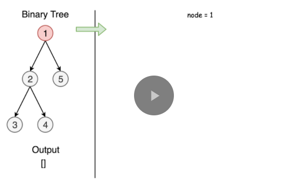
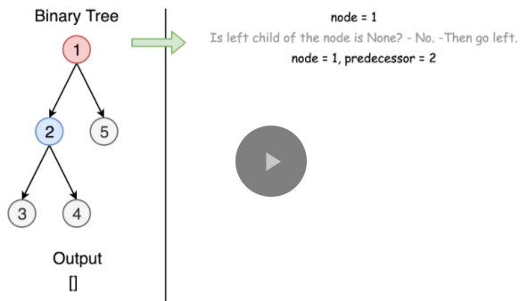
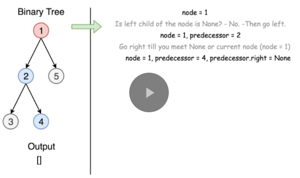
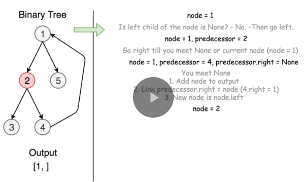
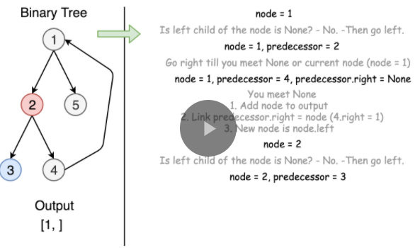
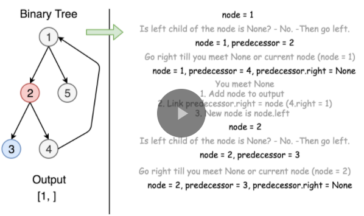
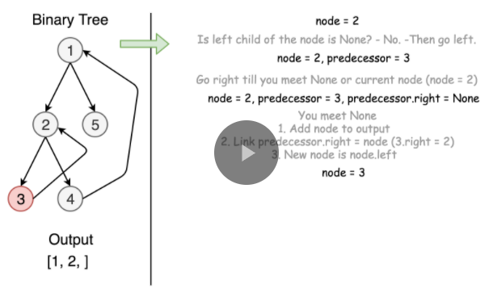
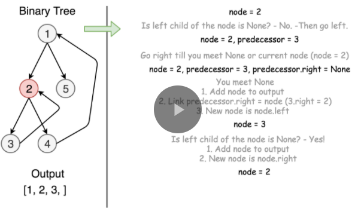
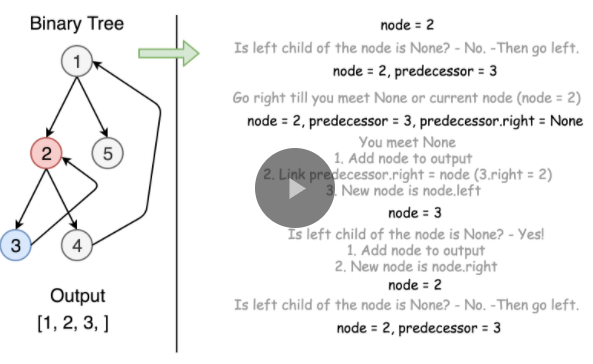
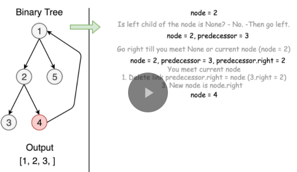
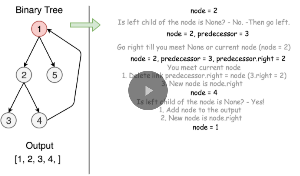
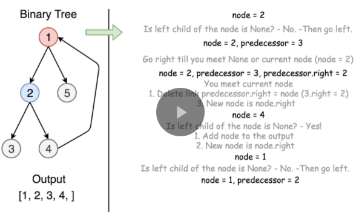
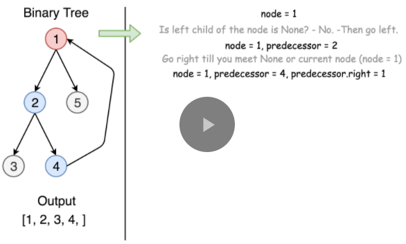
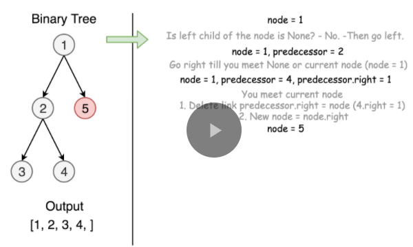
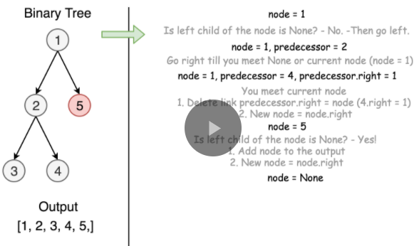


```python
class Solution(object):
    def preorderTraversal(self, root):
        """
        :type root: TreeNode
        :rtype: List[int]
        """
        node, output = root, []
        while node:
            if not node.left:
                output.append(node.val)
                node = node.right
            else:
                predecessor = node.left

                while predecessor.right and predecessor.right is not node:
                    predecessor = predecessor.right

                if not predecessor.right:
                    output.append(node.val)
                    predecessor.right = node
                    node = node.left
                else:
                    predecessor.right = None
                    node = node.right

        return output
```

#### Complexity Analysis

**Time Complexity:** $O(N)$

We visit each predecessor exactly twice descending down from the node, thus the time complexity is $O(N)$, where N is the number of nodes, i.e. the size of tree.

**Space Complexity:** $O(N)$

We use no additional memory for the computation itself, but output list contains N elements, and thus space complexity is $O(N)$.
