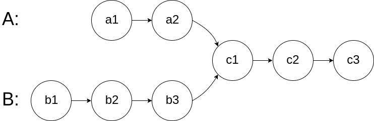
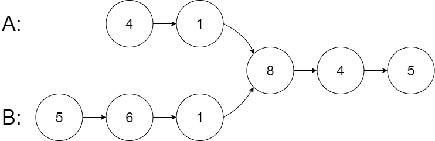
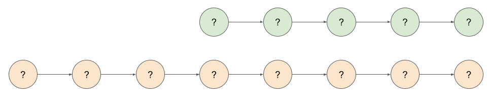
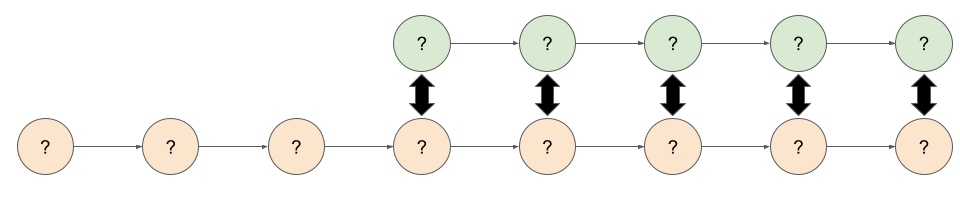
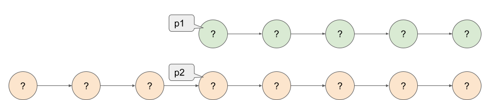
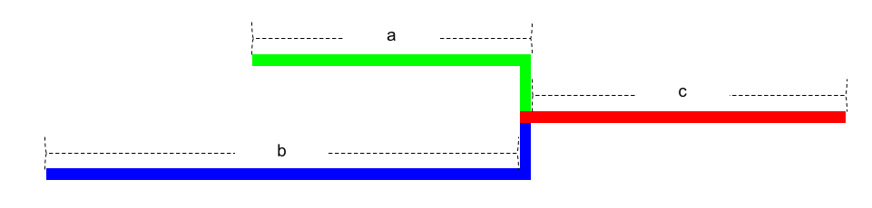

# Intersection of Two Linked Lists (Easy)

## Description

Given the heads of two singly linked-lists headA and headB, return the node at which the two lists intersect. If the two linked lists have no intersection at all, return null.

For example, the following two linked lists begin to intersect at node c1:



The test cases are generated such that there are no cycles anywhere in the entire linked structure.

**Note** that the linked lists must **retain their original structure** after the function returns.

**Custom Judge:**

The inputs to the **judge** are given as follows (your program is not given these inputs):

- **intersectVal** - The value of the node where the intersection occurs. This is 0 if there is no intersected node.
- **listA** - The first linked list.
- **listB** - The second linked list.
- **skipA** - The number of nodes to skip ahead in listA (starting from the head) to get to the intersected node.
- **skipB** - The number of nodes to skip ahead in listB (starting from the head) to get to the intersected node.

The judge will then create the linked structure based on these inputs and pass the two heads, headA and headB to your program. If you correctly return the intersected node, then your solution will be accepted.

**Example 1:**



**Input**: intersectVal = 8, listA = [4,1,8,4,5], listB = [5,6,1,8,4,5], skipA = 2, skipB = 3  
**Output**: Intersected at '8'  
**Explanation**: The intersected node's value is 8 (note that this must not be 0 if the two lists intersect).  
From the head of A, it reads as [4,1,8,4,5]. From the head of B, it reads as [5,6,1,8,4,5]. There are 2 nodes before the intersected node in A; There are 3 nodes before the intersected node in B.

**Example 2:**


**Input**: intersectVal = 2, listA = [1,9,1,2,4], listB = [3,2,4], skipA = 3, skipB = 1  
**Output**: Intersected at '2'  
**Explanation**: The intersected node's value is 2 (note that this must not be 0 if the two lists intersect).  
From the head of A, it reads as [1,9,1,2,4]. From the head of B, it reads as [3,2,4]. There are 3 nodes before the intersected node in A; There are 1 node before the intersected node in B.

**Example 3:**


**Input**: intersectVal = 0, listA = [2,6,4], listB = [1,5], skipA = 3, skipB = 2  
**Output**: No intersection  
**Explanation**: From the head of A, it reads as [2,6,4]. From the head of B, it reads as [1,5]. Since the two lists do not intersect, intersectVal must be 0, while skipA and skipB can be arbitrary values.
Explanation: The two lists do not intersect, so return null.

**Constraints**:

The number of nodes of $listA$ is in the $m$.  
The number of nodes of $listB$ is in the $n$.  
$0 \leq m, n \leq 3 \times 10^4$  
$1 \leq Node.val \leq 105$  
$0 \leq skipA \leq m$  
$0 \leq skipB \leq n$  
$intersectVal$ is $0$ if $listA$ and $listB$ do not intersect.  
$intersectVal == listA[skipA] == listB[skipB]$ if $listA$ and $listB$ intersect.

Follow up: Could you write a solution that runs in O(n) time and use only O(1) memory?

## Solution

### Overview

For this article, we're assuming that you know what a linked list is, and can solve very basic linked list problems such as determining the length of a given linked list. If you're not yet at that level, we recommend checking out our [Explore Card on linked lists](https://leetcode.com/explore/learn/card/linked-list/).

We'll be referring to the linked list starting at headA as "list A" and the linked list starting at headB as "list B".

### Approach 1: Brute Force

#### Intuition and Algorithm

The brute force solution is often a good starting point in an interview. While you shouldn't actually code up this approach (it's not a good use of time to do so), you should briefly explain it to your interviewer. Once you've done that, you'll then be analyzing inefficiencies and coming up with ways to optimize it.

The brute force solution here is nothing too special: For each node in list A, traverse over list B and check whether or not the node is present in list B.

The one thing we need to be careful of is that we're comparing objects of type Node. We don't want to compare the values within the nodes; doing this would cause our code to break when two different nodes have the same value.

#### Implementation

Note that we're only showing this code for your reference. This is not a good approach for an interview, and the only reason we discussed it at all as we will be optimizing it in Approach 2. For this reason, we aren't guaranteeing that the code will pass our judge in every language.

```python
class Solution:
    def getIntersectionNode(self, headA: ListNode, headB: ListNode) -> ListNode:
        while headA is not None:
            pB = headB
            while pB is not None:
                if headA == pB:
                    return headA
                pB = pB.next
            headA = headA.next

        return None
```

#### Complexity Analysis

Let $N$ be the length of list A and $M$ be the length of list B.

Time complexity : $O(N \times M)$.

For each of the $N$ nodes in list A, we are traversing over each of the nodes in list B. In the worst case, we won't find a match, and so will need to do this until reaching the end of list B, giving a worst-case time complexity of $O(N \times M)$.

Space complexity : $O(1)$.

We aren't allocating any additional data structures, so the amount of extra space used does not grow with the size of the input.

### Approach 2: Hash Table

#### Intuition

If you are unfamiliar with hash tables, check out our [Explore Card](https://leetcode.com/explore/learn/card/hash-table/182/practical-applications/1109/).

Approach 1 is inefficient because we repeatedly traverse over list B to check whether or not any of the nodes in list B were equal to the current one we were looking at in list A. Instead of repeatedly traversing through list B though, we could simply traverse it once and store each node in a hash table. We could then traverse through list A once, each time checking whether the current node exists in the hash table.

#### Algorithm

Traverse list B and store the address/reference of each node in a hash table. Then for each node in list A, check whether or not that node exists in the hash table. If it does, return it as it must be the intersection node. If we get to the end of list A without finding an intersection node, return null.

The one thing we need to be careful of is that we're comparing objects of type Node. We don't want to compare the values within the nodes; doing this would cause our code to break when two different nodes have the same value.

#### Implementation

```python
class Solution:
    def getIntersectionNode(self, headA: ListNode, headB: ListNode) -> ListNode:
        nodes_in_B = set()

        while headB is not None:
            nodes_in_B.add(headB)
            headB = headB.next

        while headA is not None:
            # if we find the node pointed to by headA,
            # in our set containing nodes of B, then return the node
            if headA in nodes_in_B:
                return headA
            headA = headA.next

        return None
```

#### Complexity Analysis

Time complexity : $O(N + M)$.

Firstly, we need to build up the hash table. It costs $O(1)$ to insert an item into a hash table, and we need to do this for each of the $M$ nodes in list B. This gives a cost of $O(M)$ for building the hash table.

Secondly, we need to traverse list A, and for each node, we need to check whether or not it is in the hash table. In the worst case, there will not be a match, requiring us to check all NN nodes in list A. As it is also $O(1)$ to check whether or not an item is in a hash table, this checking has a total cost of $O(N)$.

Finally, combining the two parts, we get $O(M) + O(N) = O(M + N)$.

Space complexity : $O(M)$.

As we are storing each of the nodes from list B into a hash table, the hash table will require $O(M)$ space. Note that we could have instead stored the nodes of list A into the hash table, this would have been a space complexity of $O(N)$. Unless we know which list is longer though, it doesn't make any real difference.

### Approach 3: Two Pointers

> **Interview Tip**: Approach 3 is essentially a "medium" solution to an "easy" problem. Note that approach 2 is probably sufficient for an interview if you are fairly new to programming (for example, you're applying for an internship during your early years of college). If you're more experienced, it might also be sufficient, but your safest bet would be to also know Approach 3, and to be able to apply the intuition behind it to similar problems. While it might initially look scary, you'll be fine with it once you have a think about it and try and draw a few examples.

#### Intuition

We know that we've now fully optimized the time complexity: it's impossible to do better than $O(N + M)$ as, in the worst case, we'll need to look at every node at least once. But, is there a way we can get the space complexity down to $O(1)$ while maintaining that awesome $O(N + M)$ time complexity that we just achieved? It turns out that there is!

Observe that while list A and list B could be different lengths, that the shared "tail" following the intersection has to be the same length.

Imagine that we have two linked lists, A and B, and we know that their lengths are $N$ and $M$ respectively (these can be calculated with $O(1)$ space and in time proportional to the length of the list). We'll imagine that $N = 5$ and $M = 8$.



Because the "tails" must be the same length, we can conclude that if there is an intersection, then the intersection node will be one of these 5 possibilities.



So, to check for each of these pairs, we would start by setting a pointer at the start of the shorter list, and a pointer at the first possible matching node of the longer list. The position of this node is simply the difference between the two lengths, that is, $|M - N|$.



Then, we just need to step the two pointers through the list, each time checking whether or not the nodes are the same.

In code, we could write this algorithm with 4 loops, one after the other, each doing the following:

1. Calculate $N$; the length of list A.
2. Calculate $M$; the length of list B.
3. Set the start pointer for the longer list.
4. Step the pointers through the list together.

While this would have a time complexity of $O(N + M)$ and a space complexity of $O(1)$ and would be fine for an interview, we can still simplify the code a bit! As some quick reassurance, most people will struggle to come up with this next part by themselves. It takes practice and seeing lots of linked list and other math problems.

If we say that $c$ is the shared part, $a$ is exclusive part of list A and $b$ is exclusive part of list B, then we can have one pointer that goes over $a + c + b$ and the other that goes over $b + c + a$. Have a look at the diagram below, and this should be fairly intuitive.



This is the above algorithm in disguise - one pointer is essentially measuring the length of the longer list, and the other is measuring the length of the shorter list, and then placing the start pointer for the longer list. Then both are stepping through the list together. By seeing the solution in this way though, we can now implement it as a single loop.

#### Algorithm

- Set pointer `pA` to point at `headA`.
- Set pointer `pB` to point at `headB`.
- While `pA` and `pB` are not pointing at the same node:
- If `pA` is pointing to a null, set `pA` to point to `headB`.
- Else, set `pA` to point at `pA.next`.
- If `pB` is pointing to a null, set `pB` to point to `headA`.
- Else, set `pB` to point at `pB.next`.
- return the value pointed to by `pA` (or by `pB`; they're the same now).

#### Implementation

```python
class Solution:
    def getIntersectionNode(self, headA: ListNode, headB: ListNode) -> ListNode:
        pA = headA
        pB = headB

        while pA != pB:
            pA = headB if pA is None else pA.next
            pB = headA if pB is None else pB.next

        return pA
        # Note: In the case lists do not intersect, the pointers for A and B
        # will still line up in the 2nd iteration, just that here won't be
        # a common node down the list and both will reach their respective ends
        # at the same time. So pA will be NULL in that case.
```

#### Complexity Analysis

Let $N$ be the length of list A and $M$ be the length of list B.

Time complexity : $O(N + M)$.

In the worst case, each list is traversed twice giving $2 \cdot M + 2 \cdot N$, which is equivalent to $O(N + M)$. This is because the pointers firstly go down each list so that they can be "lined up" and then in the second iteration, the intersection node is searched for.

An interesting observation you might have made is that when the lists are of the same length, this algorithm only traverses each list once. This is because the pointers are already "lined up" from the start, so the additional pass is unnecessary.

Space complexity : $O(1)$.

We aren't allocating any additional data structures, so the amount of extra space used does not grow with the size of the input. For this reason, Approach 3 is better than Approach 2.
