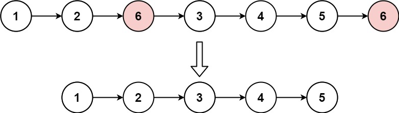
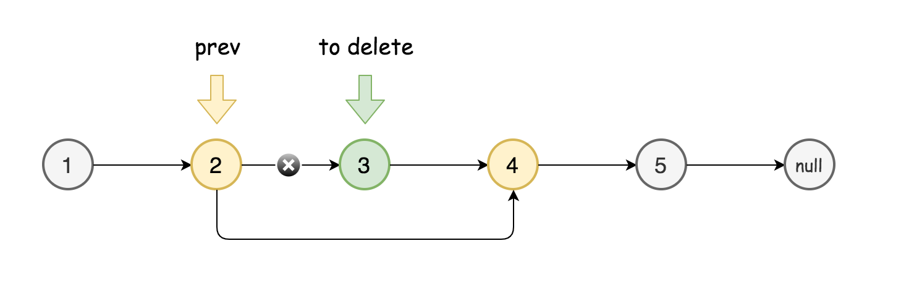
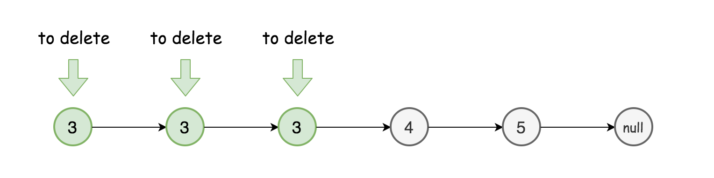
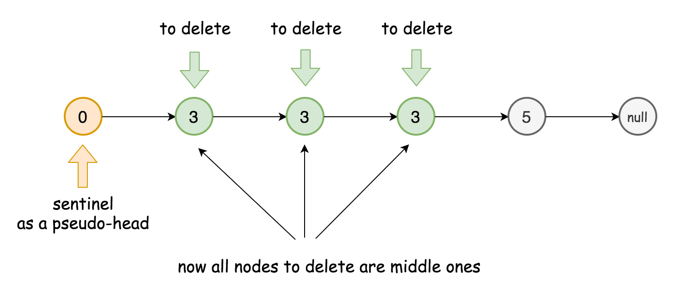

# Remove Linked List Elements (Easy)

## Description

Given the head of a linked list and an integer val, remove all the nodes of the linked list that has Node.val == val, and return the new head.

**Example 1:**



**Input**: head = [1,2,6,3,4,5,6], val = 6  
**Output**: [1,2,3,4,5]

**Example 2:**

**Input**: head = [], val = 1  
**Output**: []

**Example 3:**

**Input**: head = [7,7,7,7], val = 7  
**Output**: []

**Constraints:**

The number of nodes in the list is in the range [0, 104].  
$1 \leq Node.val \leq 50$  
$0 \leq val \leq 50$

## Solutions

### Approach 1: Sentinel Node

#### Intuition

The problem seems to be very easy if one has to delete a node in the middle:

- Pick the node-predecessor prev of the node to delete.
- Set its next pointer to point to the node next to the one to delete.



The things are more complicated when the node or nodes to delete are in the head of linked list.



> How to deal with that? To reduce the problem to the deletion of middle nodes with the help of [sentinel node](https://en.wikipedia.org/wiki/Sentinel_node).

Sentinel nodes are widely used in trees and linked lists as pseudo-heads, pseudo-tails, markers of level end, etc. They are purely functional, and usually does not hold any data. Their main purpose is to standardize the situation, for example, make linked list to be never empty and never headless and hence simplify insert and delete.

Here are two standard examples:

- [LRU Cache](https://leetcode.com/articles/lru-cache/), sentinel nodes are used as pseudo-head and pseudo-tail.
- [Tree Level Order Traversal](https://leetcode.com/articles/maximum-level-sum-of-a-binary-tree/), sentinel nodes are used to mark level end.



Here sentinel node will be used as pseudo-head.

#### Algorithm

- Initiate sentinel node as `ListNode(0)` and set it to be the new head: `sentinel.next = head`.
- Initiate two pointers to track the current node and its predecessor: `curr` and `prev`.
- While `curr` is not a null pointer:
  - Compare the value of the current node with the value to delete.
    - In the values are equal, delete the current node: `prev.next = curr.next`.
    - Otherwise, set predecessor to be equal to the current node.
  - Move to the next node: `curr = curr.next`.
- Return `sentinel.next`.

#### Implementation

```python
class Solution:
    def removeElements(self, head: ListNode, val: int) -> ListNode:
        sentinel = ListNode(0)
        sentinel.next = head

        prev, curr = sentinel, head
        while curr:
            if curr.val == val:
                prev.next = curr.next
            else:
                prev = curr
            curr = curr.next

        return sentinel.next
```

#### Complexity Analysis

**Time Complexity**: $O(n)$

it's one pass solution.

**Space Complexity**: $O(1)$

it's a constant space solution.
