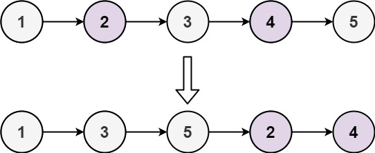
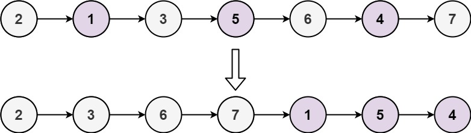
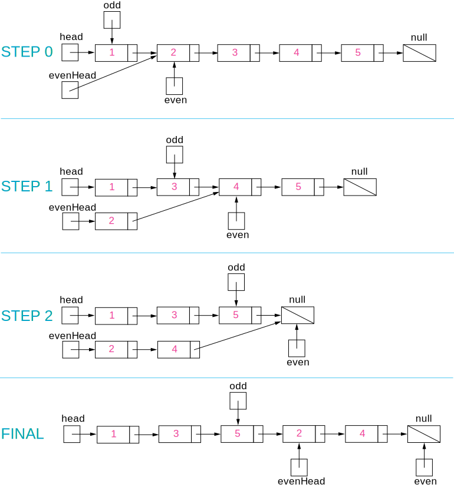

# Odd Even Linked List (Medium)

## Description

Given the head of a singly linked list, group all the nodes with odd indices together followed by the nodes with even indices, and return the reordered list.

The first node is considered odd, and the second node is even, and so on.

Note that the relative order inside both the even and odd groups should remain as it was in the input.

You must solve the problem in O(1) extra space complexity and O(n) time complexity.

**Example 1:**

**Input**: head = [1,2,3,4,5]  
**Output**: [1,3,5,2,4]

**Example 2:**

**Input**: head = [2,1,3,5,6,4,7]  
Output: [2,3,6,7,1,5,4]

**Constraints:**

$n ==$ number of nodes in the linked list  
$0 \leq n \leq 104$  
$-106 \leq Node.val \leq 106$

## Solution

### Intuition

Put the odd nodes in a linked list and the even nodes in another. Then link the evenList to the tail of the oddList.

### Algorithm

The solution is very intuitive. But it is not trivial to write a concise and bug-free code.

A well-formed `LinkedList` need two pointers head and tail to support operations at both ends. The variables head and odd are the head pointer and tail pointer of one `LinkedList` we call `oddList`; the variables `evenHead` and even are the head pointer and tail pointer of another `LinkedList` we call `evenList`. The algorithm traverses the original `LinkedList` and put the odd nodes into the `oddList` and the even nodes into the `evenList`. To traverse a `LinkedList` we need at least one pointer as an iterator for the current node. But here the pointers odd and even not only serve as the tail pointers but also act as the iterators of the original list.

The best way of solving any linked list problem is to visualize it either in your mind or on a piece of paper. An illustration of our algorithm is following:

### Complexity Analysis

**Time Complexity:** $O(n)$

There are total nn nodes and we visit each node once.

**Space Complexity:** $O(1)$

All we need is the four pointers.
