# Flatten a Multilevel Doubly Linked List (Medium)

## Description

You are given a doubly linked list which in addition to the next and previous pointers, it could have a child pointer, which may or may not point to a separate doubly linked list. These child lists may have one or more children of their own, and so on, to produce a multilevel data structure, as shown in the example below.

Flatten the list so that all the nodes appear in a single-level, doubly linked list. You are given the head of the first level of the list.

### Example 1:

**Input:** head = [1,2,3,4,5,6,null,null,null,7,8,9,10,null,null,11,12]  
**Output:** [1,2,3,7,8,11,12,9,10,4,5,6]

**Explanation:**

The multilevel linked list in the input is as follows:

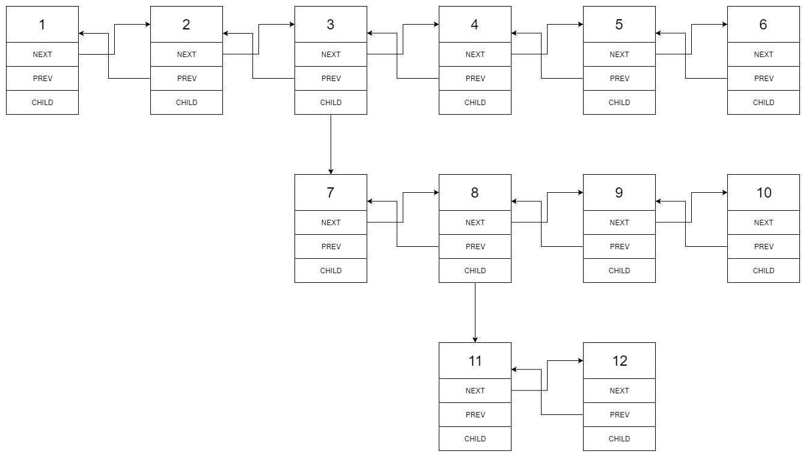

After flattening the multilevel linked list it becomes:

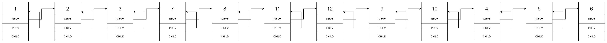

### Example 2:

**Input:** head = [1,2,null,3]  
**Output:** [1,3,2]

**Explanation:**

The input multilevel linked list is as follows:

1---2---NULL  
|  
3---NULL

### Example 3:

**Input:** head = []  
**Output:** []

How multilevel linked list is represented in test case:

We use the multilevel linked list from Example 1 above:

1---2---3---4---5---6--NULL  
|  
7---8---9---10--NULL  
|  
11--12--NULL

The serialization of each level is as follows:

[1,2,3,4,5,6,null]  
[7,8,9,10,null]  
[11,12,null]

To serialize all levels together we will add nulls in each level to signify no node connects to the upper node of the previous level. The serialization becomes:

[1,2,3,4,5,6,null]  
[null,null,7,8,9,10,null]  
[null,11,12,null]

Merging the serialization of each level and removing trailing nulls we obtain:

[1,2,3,4,5,6,null,null,null,7,8,9,10,null,null,11,12]

### Constraints:

The number of Nodes will not exceed `1000`.  
$1 \leq Node.val \leq 105$

## Solutions

### Approach 1: DFS by Recursion

#### Intuition

People might ask themselves in which scenario that one would use such an awkward data structure. Well, one of the scenarios could be a simplified version of git branching. By flattening the multilevel list, one can think it as merging all git branches together, though it is not at all how the git merge works.

First of all, to clarify what is the desired result of the flatten operation, we illustrate with an example below.

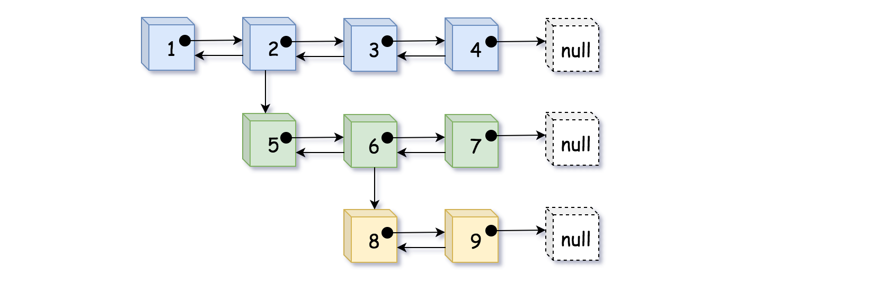

In the above example, we distinguish nodes in different levels with different colors. We could flatten the list in two steps as follows:

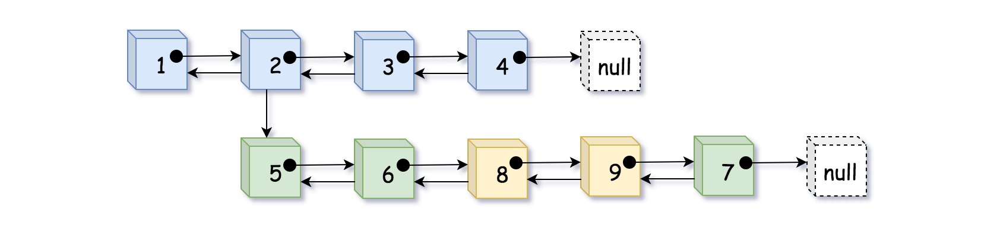

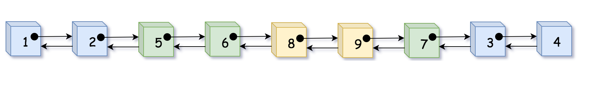

> As we can see, by flatten, we basically **fold or embed** the sublist that is branched from the child pointer into its parent list.

This is one way to interpret the _flatten_ operation. However, as intuitive as the problem seems to be, one might stumble over the implementation. It is because the above intuition does not quite catch the true nature of the problem.

> Actually, if we turn the above list in 90 degrees around the clock, then suddenly a **binary** tree appear in front of us. And the flatten operation is basically what we call **_preorder DFS traversal_** (Depth-First Search).

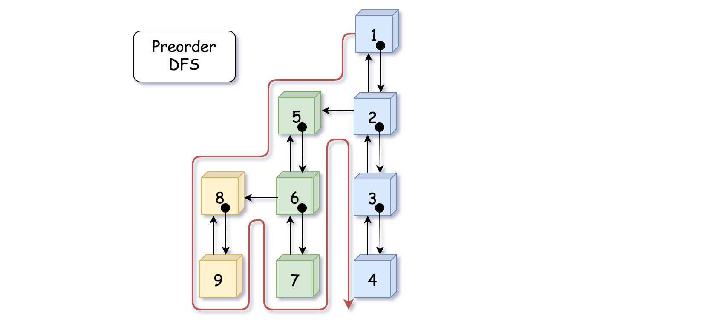

Indeed, as shown in the above graph, we could consider the `child` pointer as the `left` pointer in binary tree which points to the left sub-tree (sublist). And similarly, the `next` pointer can be considered as the `right` pointer in binary tree. Then if we traverse the tree in preorder DFS, it would generate the same visiting sequence as the flatten operation in our problem.

#### Algorithm

Now that we know the problem is basically asking us to do a _preorder DFS traversal_ over a disguised binary tree, we could use this intuition to guide the implementation.

As many of you would know that there are generally two manners to implement the DFS traversal: _recursion_ and _iteration_. We here start with the recursion, since many find it more intuitive.

Here it goes with the recursive DFS algorithm:

- First of all, we define our recursive function as `flatten_dfs(prev, curr)` which takes two pointers as input and returns the pointer of tail in the _flattened_ list. The `curr` pointer leads to the sub-list that we would like to flatten, and the `prev` pointer points to the element that should precede the `curr` element.

- Within the recursive function `flatten_dfs(prev, curr)`, we first establish the double links between the `prev` and `curr` nodes, as in the **preorder** DFS we take care of the **current state** first before looking into the children.

- Further in the function `flatten_dfs(prev, curr)`, we then go ahead to flatten the **left subtree** (i.e. the sublist pointed by the `curr.child` pointer) with the call of `flatten_dfs(curr, curr.child)`, which returns the `tail` element to the flattened sublist. Then with the `tail` element of the previous sublist, we then further flatten the **right subtree** (i.e. the sublist pointed by the `curr.next` pointer), with the call of `flatten_dfs(tail, curr.next)`.

- And voila, that is our core function. There are two additional important details that we should attend to, in order to obtain the correct result:

  - We should make a copy of the `curr.next` pointer before the first recursive call of `flatten_dfs(curr, curr.child)`, since the `curr.next` pointer might be altered within the function.

  - After we flatten the sublist pointed by the `curr.child` pointer, we should remove the child pointer since it is no longer needed in the final result.

- Last by not the least, one would notice in the following implementation that we create a `pseudoHead` variable in the function. This is not absolutely necessary, but it would help us to make the solution more concise and elegant by **reducing the null pointer checks** (e.g. if `prev == null`). And with less branching tests, it certainly helps with the performance as well. Sometimes people might call it **_sentinel_** node. As one might have seen before, this is a useful trick that one could apply to many problems related with linked lists (e.g. [LRU cache](https://leetcode.com/articles/lru-cache/)).

#### Implementation

```python
"""
# Definition for a Node.
class Node(object):
    def __init__(self, val, prev, next, child):
        self.val = val
        self.prev = prev
        self.next = next
        self.child = child
"""
class Solution(object):

    def flatten(self, head):
        if not head:
            return head

        # pseudo head to ensure the `prev` pointer is never none
        pseudoHead = Node(None, None, head, None)
        self.flatten_dfs(pseudoHead, head)

        # detach the pseudo head from the real head
        pseudoHead.next.prev = None
        return pseudoHead.next


    def flatten_dfs(self, prev, curr):
        """ return the tail of the flatten list """
        if not curr:
            return prev

        curr.prev = prev
        prev.next = curr

        # the curr.next would be tempered in the recursive function
        tempNext = curr.next
        tail = self.flatten_dfs(curr, curr.child)
        curr.child = None
        return self.flatten_dfs(tail, tempNext)
```

#### Complexity

**Time Complexity:** $O(N)$

where N is the number of nodes in the list. The DFS algorithm traverses each node once and only once.

**Space Complexity:** $O(N)$

where N is the number of nodes in the list. In the worst case, the binary tree might be extremely unbalanced (i.e. the tree leans to the left), which corresponds to the case where nodes are chained with each other only with the `child` pointers. In this case, the recursive calls would pile up, and it would take $N$ space in the function call stack.

### Approach 2: DFS by Iteration

#### Intuition

Following the intuition of the above DFS preorder traversal approach, here we demonstrate how one can implement the solution via **_iteration_**.

> The key is to use the data structure called **_stack_**, which is a container that follows the principle of _LIFO (last in, first out)_. The element that enters the stack at last would come out first, similar with the scenario of a packed elevator.

The stack data structure helps us to construct the iteration sequence as the one created by recursion. The stack here mimics the behavior of the function _call stack_, so that we could obtain the same result without resorting to recursion.

#### Algorithm

- First of all, we create a stack and then we push the head node to the stack. In addition, we create a variable called `prev` which would help us to track the precedent node at each step during the iteration.

- Then we enter a loop to iterate the stack until the stack becomes empty.

- Within the loop, at each step, we first pop out a node (named `curr`) from the stack. Then we establish the links between `prev` and `curr`. Then in the following steps, we take care of the nodes pointed by the `curr.next` and `curr.child` pointers respectively, and strictly in this order.

  - First, if the `curr.next` does exist (i.e. there exists a right subtree), we then push the node into the stack for the next iteration.

  - Secondly, if the `curr.child` does exist (i.e. there exists a left subtree), we then push the node into the stack. In addition, unlike the `child.next` pointer, we need to clean up the `curr.child` pointer since it should not be present in the final result.

- And voila. Lastly, we also employ the `pseudoHead` node to render the algorithm more elegant, as we discussed in the previous approach.

To better illustrate how the algorithm works, we create an animation that shows the evolution of stack step by step, as follows:

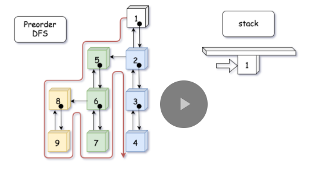
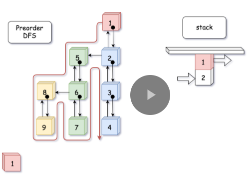
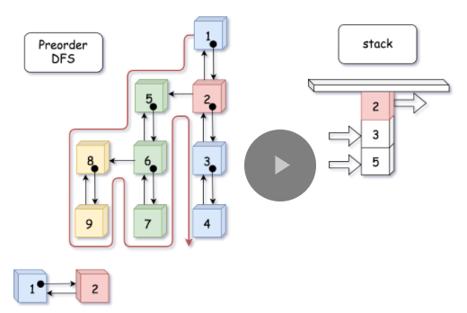
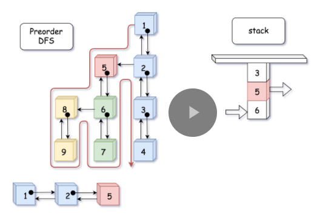
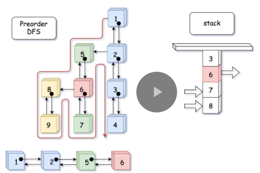
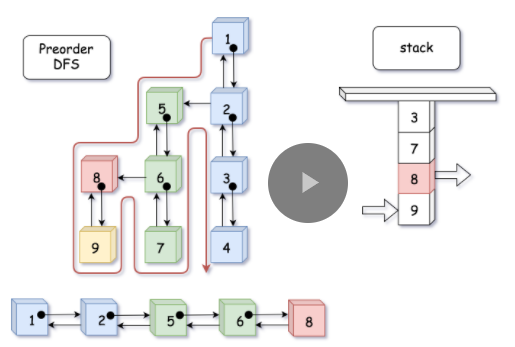
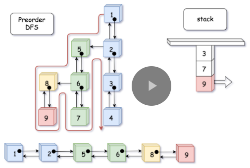
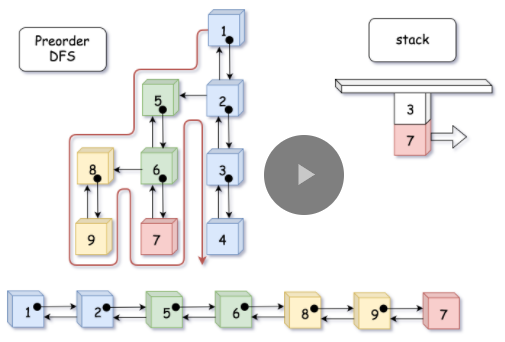
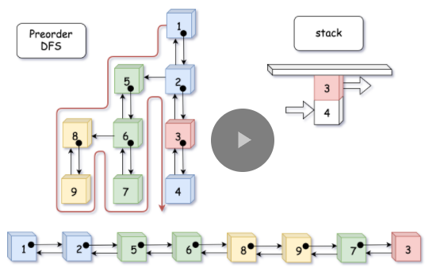
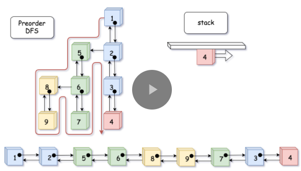
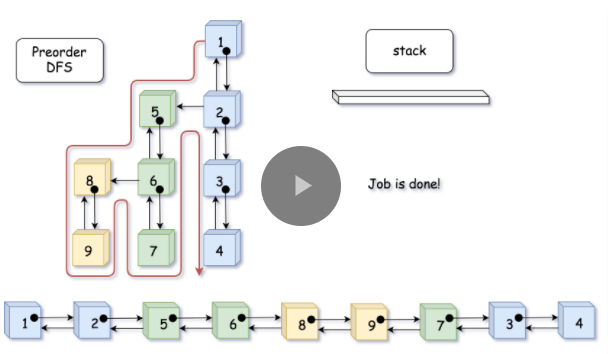

#### Complexity

**Time Complexity:** $O(N)$

The iterative solution has the same time complexity as the recursive.

**Space Complexity:** $O(N)$

Again, the iterative solution has the same space complexity as the recursive one.
