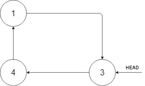
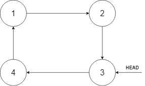
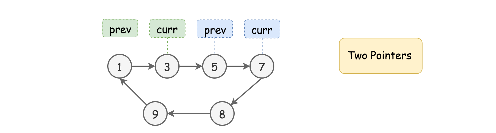
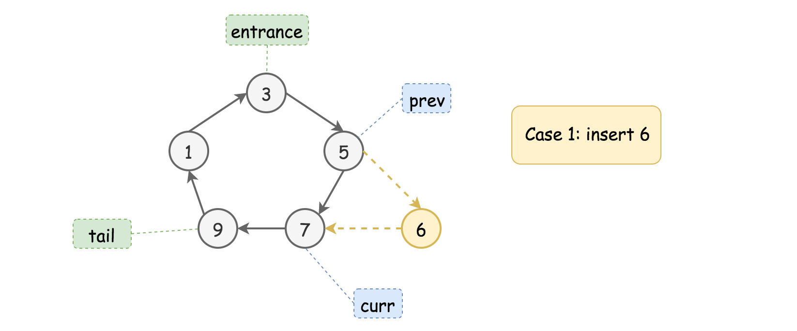
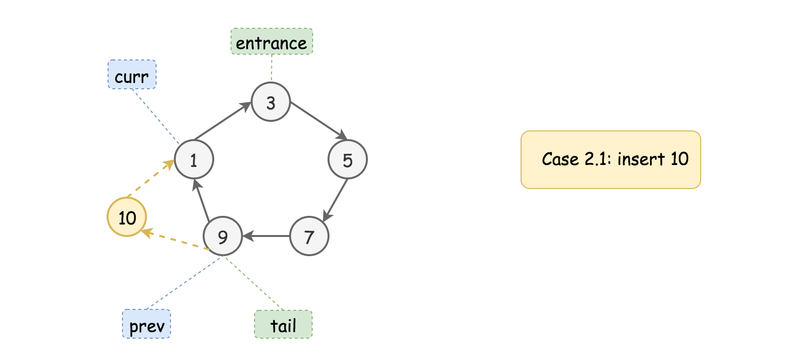
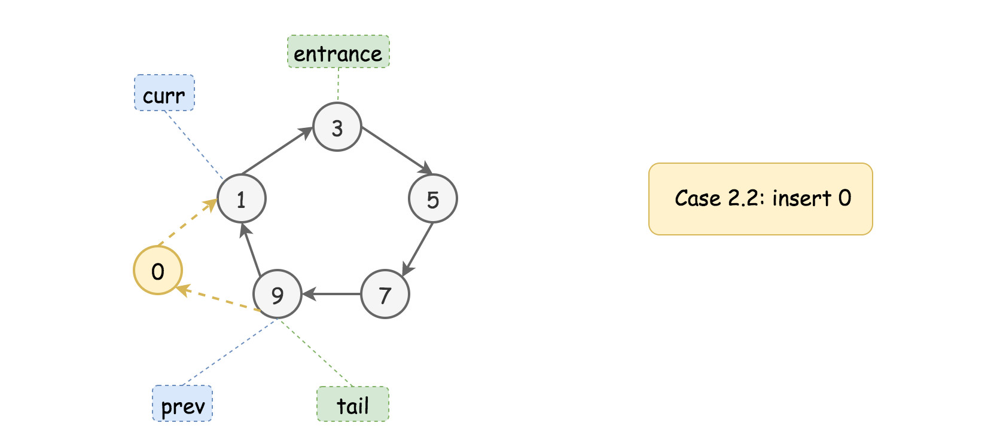
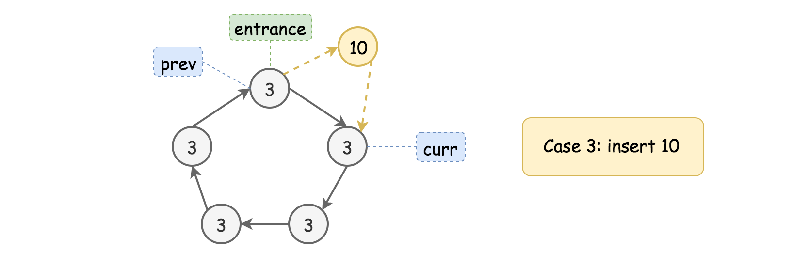

# Insert into a Sorted Circular Linked List (Medium)

## Description

Given a Circular Linked List node, which is sorted in ascending order, write a function to insert a value `insertVal` into the list such that it remains a sorted circular list. The given node can be a reference to any single node in the list and may not necessarily be the smallest value in the circular list.

If there are multiple suitable places for insertion, you may choose any place to insert the new value. After the insertion, the circular list should remain sorted.

If the list is empty (i.e., the given node is `null`), you should create a new single circular list and return the reference to that single node. Otherwise, you should return the originally given node.

\*1Example 1:\*\*



**Input:** head = [3,4,1], insertVal = 2  
**Output:** [3,4,1,2]  
**Explanation:** In the figure above, there is a sorted circular list of three elements. You are given a reference to the node with value 3, and we need to insert 2 into the list. The new node should be inserted between node 1 and node 3. After the insertion, the list should look like this, and we should still return node 3.



**Example 2:**

**Input:** head = [], insertVal = 1  
**Output:** [1]  
**Explanation:** The list is empty (given head is null). We create a new single circular list and return the reference to that single node.

**Example 3:**

**Input:** head = [1], insertVal = 0  
**Output:** [1,0]

**Constraints:**

$0 \leq Number of Nodes \leq 5 * 10^4$  
$-10^6 \leq Node.val, insertVal \leq 10^6$

## Solution

### Approach 1: Two-Pointers Iteration

#### Intuition

As simple as the problem might seem to be, it is actually not trivial to write a solution that covers all cases.

> Often the case for the problems with linked list, one could apply the approach of **Two-Pointers Iteration**, where one uses two pointers as surrogate to traverse the linked list.

One of reasons of having two pointers rather than one is that in singly-linked list one does not have a reference to the precedent node, therefore we keep an additional pointer which points to the precedent node.

> For this problem, we iterate through the cyclic list using two pointers, namely `prev` and `curr`. When we find a suitable place to insert the new value, we insert it between the `prev` and `curr` nodes.



#### Algorithm

First of all, let us define the skeleton of two-pointers iteration algorithm as follows:

- As we mentioned in the intuition, we loop over the linked list with two pointers (i.e. `prev` and `curr`) step by step. The termination condition of the loop is that we get back to the starting point of the two pointers (i.e. `prev == head`)

- During the loop, at each step, we check if the current place bounded by the two pointers is the right place to insert the new value.

- If not, we move both pointers one step forwards.

Now, the tricky part of this problem is to sort out different cases that our algorithm should deal with within the loop, and then design a _concise_ logic to handle them sound and properly. Here we break it down into three general cases.

> **Case 1.** The value of new node sits between the minimal and maximal values of the current list. As a result, it should be inserted within the list.



As we can see from the above example, the new value (`6`) sits between the minimal and maximal values of the list (i.e. `1` and `9`). No matter where we start from (in this example we start from the node `{3}`), the new node would end up being inserted between the nodes `{5}` and `{7}`.

_The condition is to find the place that meets the constraint of `{prev.val <= insertVal <= curr.val}`._

> **Case 2.** The value of new node goes beyond the minimal and maximal values of the current list, either less than the minimal value or greater than the maximal value. In either case, the new node should be added right after the _tail_ node (i.e. the node with the maximal value of the list).

Here are the examples with the same input list as in the previous example.





Firstly, we should locate the position of the **tail** node, by finding a descending order between the adjacent, i.e. the condition of `{prev.val > curr.val}`, since the nodes are sorted in ascending order, the tail node would have the greatest value of all nodes.

Furthermore, we check if the new value goes beyond the values of tail and head nodes, which are pointed by the `prev` and `curr` pointers respectively.

The Case 2.1 corresponds to the condition where the value to be inserted is _greater than or equal_ to the one of tail node, i.e. `{insertVal >= prev.val}`.

The Case 2.2 corresponds to the condition where the value to be inserted is _less than or equal to the head node_, i.e. `{insertVal <= curr.val}`.

Once we locate the tail and head nodes, we basically **_extend_** the original list by inserting the value in between the tail and head nodes, i.e. in between the `prev` and `curr` pointers, the same operation as in the Case 1.

> **Case 3**. Finally, there is one case that does not fall into any of the above two cases. This is the case where the list contains uniform values.

Though not explicitly stated in the problem description, our sorted list can contain some duplicate values. And in the extreme case, the entire list has only one single unique value.



In this case, we would end up looping through the list and getting back to the starting point.

The _followup action is just to add the new node after any node in the list, regardless the value to be inserted_. Since we are back to the starting point, we might as well add the new node right after the starting point (our entrance node).

Note that, we cannot skip the iteration though, since we have to iterate through the list to determine if our list contains a single unique value.

> The above three cases cover the scenarios within and after our iteration loop. There is however one minor **corner** case we still need to deal with, where we have an **empty** list. This, we could easily handle before the loop.

#### Implementation

```python
class Solution:
    def insert(self, head: 'Node', insertVal: int) -> 'Node':

        if head == None:
            newNode = Node(insertVal, None)
            newNode.next = newNode
            return newNode

        prev, curr = head, head.next
        toInsert = False

        while True:

            if prev.val <= insertVal <= curr.val:
                # Case #1.
                toInsert = True
            elif prev.val > curr.val:
                # Case #2. where we locate the tail element
                # 'prev' points to the tail, i.e. the largest element!
                if insertVal >= prev.val or insertVal <= curr.val:
                    toInsert = True

            if toInsert:
                prev.next = Node(insertVal, curr)
                # mission accomplished
                return head

            prev, curr = curr, curr.next
            # loop condition
            if prev == head:
                break
        # Case #3.
        # did not insert the node in the loop
        prev.next = Node(insertVal, curr)
        return head
```

#### Complexity Analysis

**Time Complexity:** $O(N)$

Where N is the size of list. In the worst case, we would iterate through the entire list.

**Space Complexity:** $O(1)$

It is a constant space solution.
