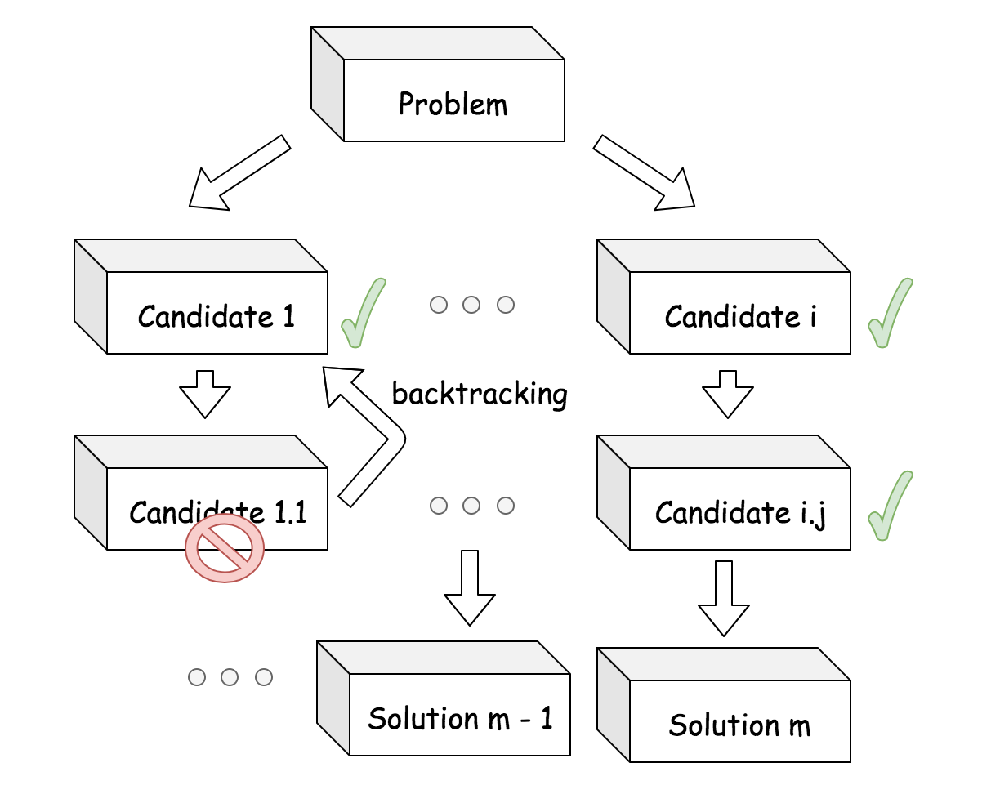
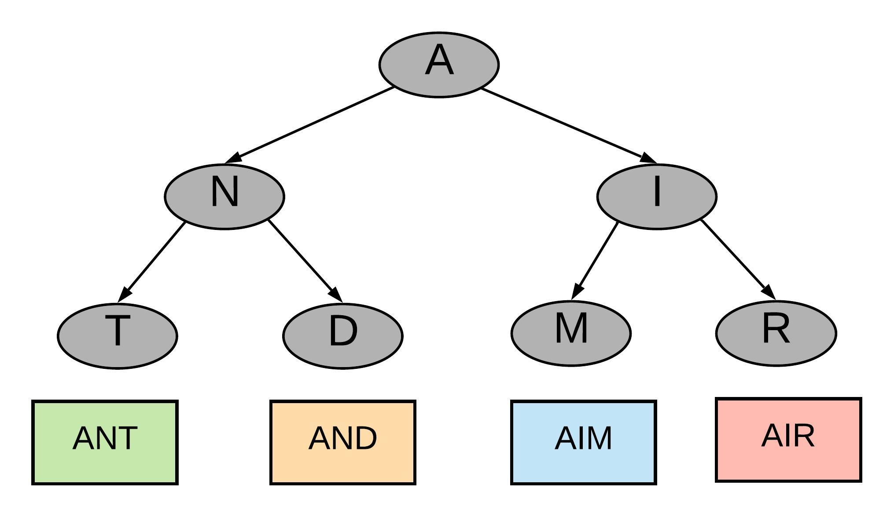
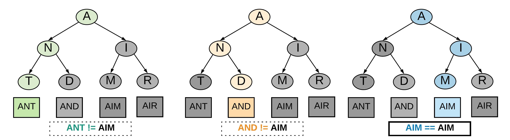
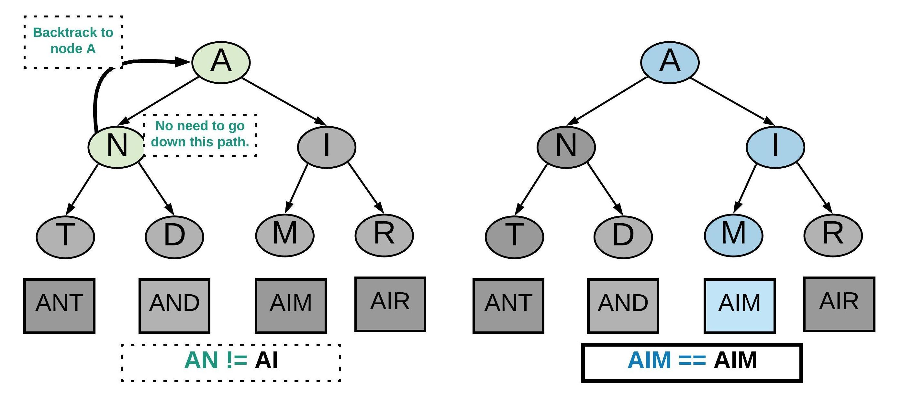
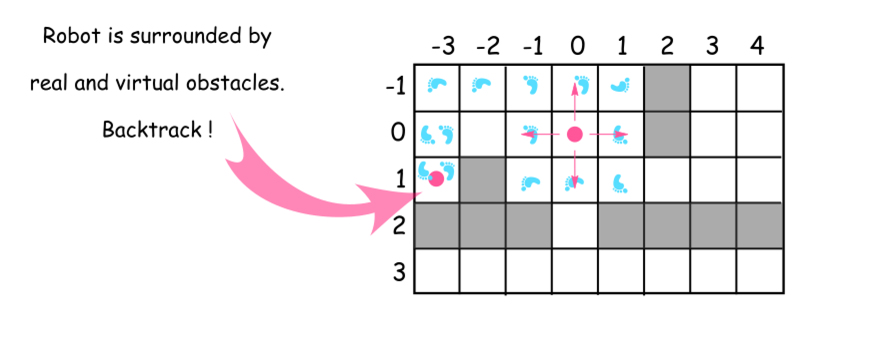
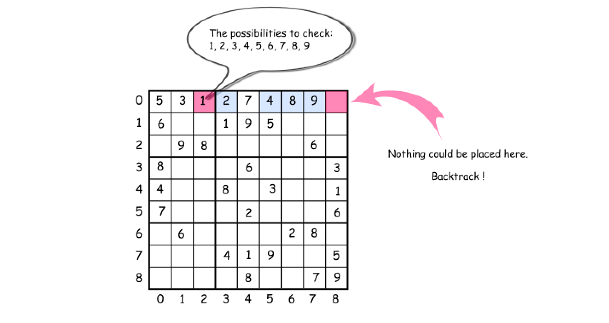

# Backtracking

[LeetCode Link](https://leetcode.com/explore/learn/card/recursion-ii/472/backtracking/2654/)

In this article, we introduce another paradigm called backtracking, which is also often implemented in the form of recursion.

> Backtracking is a general algorithm for finding all (or some) solutions to some computational problems (notably Constraint satisfaction problems or CSPs), which incrementally builds candidates to the solution and abandons a candidate ("backtracks") as soon as it determines that the candidate cannot lead to a valid solution. **[1]**



Conceptually, one can imagine the procedure of backtracking as the **_tree traversal_**. Starting from the root node, one sets out to search for solutions that are located at the leaf nodes. Each intermediate node represents a **_partial_** candidate solution that could potentially lead us to a final valid solution. At each node, we would fan out to move one step further to the final solution, _i.e._ we iterate the child nodes of the current node. Once we can determine if a certain node cannot possibly lead to a valid solution, we abandon the current node and **_backtrack_** to its parent node to explore other possibilities. It is due to this backtracking behaviour, the backtracking algorithms are often much faster than the [brute-force search](https://en.wikipedia.org/wiki/Brute-force_search) **[2]** algorithm, since it eliminates many unnecessary exploration.

## Examples

### Example 1

Let's try to understand the concept of backtracking by a very basic example. We are given a set of words represented in the form of a tree. The tree is formed such that every branch ends in a word.



Our task is to find out if a given word is present in the tree. Let's say we have to search for the word AIM. A very brute way would be to go down all the paths, find out the word corresponding to a branch and compare it with what you are searching for. You will keep doing this unless you have found out the word you were looking for.



In the diagram above our brute approach made us go down the path for **ANT** and **AND** before it finally found the right branch for the word **AIM**.

The backtracking way of solving this problem would stop going down a path when the path doesn't seem right. When we say the path doesn't seem right we mean we come across a node which will never lead to the right result. As we come across such node we **back-track**. That is go back to the previous node and take the next step.



In the above diagram backtracking didn't make us go down the path from node **N**. This is because there is a mismatch we found early on and we decided to go back to the next step instead. Backtracking reduced the number of steps taken to reach the final result. This is known as **pruning** the recursion tree because we don't take unnecessary paths.

### Example 2

One of the most classical problems that can be solved with the backtracking algorithm is the N-Queen puzzle.

> The N-queens puzzle is the problem of placing N queens on an [N×N] chessboard such that no two queens can attack each other. One is asked to count the number of solutions to place the N queens on the board. 

As a reminder, a queen can attack any piece that is situated at the same row, column or diagonal of the queue. As shown in the board below, if we place a queen at the row `1` and column `1` of the board, we then cross out all the cells that could be attached by this queen. 


In order to count the number of possible solutions to place the N queens, we can break it down into the following steps:

1. Overall, we iterate over each row in the board, i.e. once we reach the last row of the board, we should have explored all the possible solutions.

2. At each iteration (we are located at certain row), we then further iterate over each column of the board, along the current row. At this second iteration, we then can **_explore_** the possibility of placing a queen on a particular cell.

3. Before, we place a queen on the cell with index of (row, col), we need to check if this cell is under the attacking zone of the queens that have been placed on the board before. Let us assume there is a function called `i_not_under_attack(row, col)` that can do the check.

4. Once the check passes, we then can proceed to place a queen. Along with the placement, one should also mark out the attacking zone of this newly-placed queen. Let us assume there is another function called `place_queen(row, col)` that can help us to do so.

5. As an important behaviour of backtracking, we should be able to abandon our previous decision at the moment we decide to move on to the next candidate. Let us assume there is a function called `remove_queen(row, col)` that can help us to revert the decision along with the changes in step (4). 

Now, with the above steps and functions, we can organize them in the form of recursion in order to implement the algorithm. In the following, we present the pseudocode of the backtracking algorithm.

```python
def backtrack_nqueen(row = 0, count = 0):
    for col in range(n):
        # iterate through columns at the curent row.
        if is_not_under_attack(row, col):
            # explore this partial candidate solution, and mark the attacking zone
            place_queen(row, col)
            if row + 1 == n:
                # we reach the bottom, i.e. we find a solution!
                count += 1
            else:
                # we move on to the next row
                count = backtrack(row + 1, count)
            # backtrack, i.e. remove the queen and remove the attacking zone.
            remove_queen(row, col)
    return count
```

By filling out those above-mentioned functions, one should be able to implement his/her own algorithm to solve the N-queen problem. **_Note_**: one can find the exercise of N-queen problem later in this chapter.

## Template

In this article, we will present you a pseudocode template that summarizes some common patterns for the backtracking algorithms. Furthermore, we will demonstrate with some concrete examples on how to apply the template.

With the N-queen example as we presented in the previous article, one might have noticed some patterns about the backtracking algorithm. In the following, we present you a pseudocode template, which could help you to clarify the idea and structure the code when implementing the backtracking algorithms.

```python
def backtrack(candidate):
    if find_solution(candidate):
        output(candidate)
        return
    
    # iterate all possible candidates.
    for next_candidate in list_of_candidates:
        if is_valid(next_candidate):
            # try this partial candidate solution
            place(next_candidate)
            # given the candidate, explore further.
            backtrack(next_candidate)
            # backtrack
            remove(next_candidate)
```

Here are a few notes about the above pseudocode.

- Overall, the enumeration of candidates is done in two levels: 1). at the first level, the function is implemented as recursion. At each occurrence of recursion, the function is one step further to the final solution.  2). as the second level, within the recursion, we have an iteration that allows us to explore all the candidates that are of the same progress to the final solution.
- The backtracking should happen at the level of the iteration within the recursion. 
- Unlike brute-force search, in backtracking algorithms we are often able to determine if a partial solution candidate is worth exploring further (i.e. `is_valid(next_candidate)`), which allows us to prune the search zones. This is also known as the constraint, e.g. the attacking zone of queen in N-queen game. 
- There are two symmetric functions that allow us to mark the decision (place(candidate)) and revert the decision (remove(candidate)).  

In the next sections, we show some concrete examples and explain how to apply the above pseudocode template.

### Examples

#### Robot Room Cleaner

> Given a room that is represented as a grid of cells, where each cell contains a value that indicates whether it is an obstacle or not, we are asked to clean the room with a robot cleaner which can turn in four directions and move one step at a time.

This is a typical problem that can be solved with the backtracking paradigm, as many of you might have figured out from the description of the problem.

Before diving into the algorithm, to facilitate the explanation, we plot a figure below with the grid of room and the movements of robot. As one can see, the robot is denoted as the red dot and each step that the robot takes is marked as a footprint.


Fig 1. Robot Room Cleaner

We give the general idea below on how one can apply the above pseudocode template to implement a backtracking algorithm.

1. One can model each step of the robot as a recursive function (i.e. `backtrack()`).

2. At each step, technically the robot would have four candidates of direction to explore, e.g. the robot located at the coordinate of `(0, 0)`. Since not each direction is available though, one should check if the cell in the given direction is an obstacle or it has been cleaned before, i.e. `is_valid(candidate)`. Another benefit of the check is that it would greatly reduce the number of possible paths that one needs to explore.

3. Once the robot decides to explore the cell in certain direction, the robot should mark its decision (i.e. `place(candidate)`). More importantly, later the robot should be able to revert the previous decision (i.e. `remove(candidate)`), by going back to the cell and restore its original direction.

4. The robot conducts the cleaning step by step, in the form of recursion of the `backtrack()` function. The backtracking would be triggered whenever the robot reaches a point that it is surrounded either by the obstacles (e.g. cell at the row `1` and the column `-3`) or the cleaned cells. At the end of the backtracking, the robot would get back to the its starting point, and each cell in the grid would be traversed at least once. As a result, the room is cleaned at the end.

#### Sudoku Solver

> Sudoku is a popular game that many of you are familiar with. The main idea of the game is to fill a grid with only the numbers from 1 to 9, while ensuring that each row and each column as well as each sub-grid of 9 elements does not contain duplicate numbers.


Fig 2. Sudoku Game

Once again, from the description of the Sudoku problem, one might have noticed the characteristics that hint on the solution of backtracking, such as the recursive nature of problem, a number of candidate solutions and some rules to filter out the candidates etc.

Indeed, we could solve the problem with the paradigm of backtracking. We break down on how to apply the backtracking template to implement a sudoku solver in the following.

1. Given a grid with some pre-filled numbers, the task is to fill the empty cells with the numbers that meet the constraint of Sudoku game. We could model the each step to fill an empty cell as a recursion function (i.e. our famous `backtrack()` function).

2. At each step, technically we have 9 candidates at hand to fill the empty cell. Yet, we could filter out the candidates by examining if they meet the rules of the Sudoku game, (i.e. `is_valid(candidate)`).

3. Then, among all the suitable candidates, we can try out one by one by filling the cell (i.e. `place(candidate)`). Later we can revert our decision (i.e. `remove(candidate)`), so that we could try out the other candidates.

4. The solver would carry on one step after another, in the form of recursion by the `backtrack` function. The backtracking would be triggered at the points where either the solver cannot find any suitable candidate (as shown in the above figure), or the solver finds a solution to the problem. At the end of the backtracking, we would enumerate all the possible solutions to the Sudoku game. 

