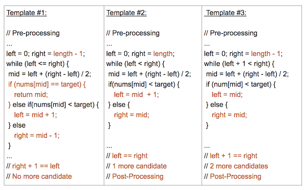

# Binary Search

## Background

### How Does It Work?

In its simplest form, Binary Search operates on a contiguous sequence with a specified left and right index. This is called the Search Space. Binary Search maintains the left, right, and middle indicies of the search space and compares the search target or applies the search condition to the middle value of the collection; if the condition is unsatisfied or values unequal, the half in which the target cannot lie is eliminated and the search continues on the remaining half until it is successful. If the search ends with an empty half, the condition cannot be fulfilled and target is not found.

In the following chapters, we will review how to identify Binary Search problems, reasons why we use Binary Search, and the 3 different Binary Search templates that you might be previously unaware of. Since Binary Search is a common interview topic, we will also categorize practice problems to different templates so you can practice using each.

**Note:**
> Binary Search can take many alternate forms and might not always be as straight forward as searching for a specific value. Sometimes you will have to apply a specific condition or rule to determine which side (left or right) to search next.

We will provide examples in the coming chapters. First, could you try write a binary search algorithm yourself?

### Identification and Template Introduction

#### How do we identify Binary Search?

As mentioned in earlier, Binary Search is an algorithm that divides the search space in 2 after every comparison. Binary Search should be considered every time you need to search for an index or element in a collection. If the collection is unordered, we can always sort it first before applying Binary Search.

#### 3 Parts of a Successful Binary Search

Binary Search is generally composed of 3 main sections:

1. Pre-processing - Sort if collection is unsorted.
2. Binary Search - Using a loop or recursion to divide search space in half after each comparison.
3. Post-processing - Determine viable candidates in the remaining space.

#### 3 Templates for Binary Search

When we first learned Binary Search, we might struggle. We might study hundreds of Binary Search problems online and each time we looked at a developer's code, it seemed to be implemented slightly differently. Although each implementation divided the problem space in 1/2 at each step, one had numerous questions:

- Why was it implemented slightly differently?
- What was the developer thinking?
- Which way was easier?
- Which way is better?

After many failed attempts and lots of hair-pulling, we found 3 main templates for Binary Search. To prevent hair-pulling and to make it easier for new developers to learn and understand, we have provided them in the next chapter.

## Template I

```python
def binarySearch(nums, target):
    """
    :type nums: List[int]
    :type target: int
    :rtype: int
    """
    if len(nums) == 0:
        return -1

    left, right = 0, len(nums) - 1
    while left <= right:
        mid = (left + right) // 2
        if nums[mid] == target:
            return mid
        elif nums[mid] < target:
            left = mid + 1
        else:
            right = mid - 1

    # End Condition: left > right
    return -1
```

Template #1 is the most basic and elementary form of Binary Search. It is the standard Binary Search Template that most high schools or universities use when they first teach students computer science. Template #1 is used to search for an element or condition which can be determined by accessing a single index in the array.

 

### Key Attributes:

- Most basic and elementary form of Binary Search
- Search Condition can be determined without comparing to the element's neighbors (or use specific elements around it)
- No post-processing required because at each step, you are checking to see if the element has been found. If you reach the end, then you know the element is not found
 

### Distinguishing Syntax:

- Initial Condition: left = 0, right = length-1
- Termination: left > right
- Searching Left: right = mid-1
- Searching Right: left = mid+1

## Template II

```python
def binarySearch(nums, target):
    """
    :type nums: List[int]
    :type target: int
    :rtype: int
    """
    if len(nums) == 0:
        return -1

    left, right = 0, len(nums)
    while left < right:
        mid = (left + right) // 2
        if nums[mid] == target:
            return mid
        elif nums[mid] < target:
            left = mid + 1
        else:
            right = mid

    # Post-processing:
    # End Condition: left == right
    if left != len(nums) and nums[left] == target:
        return left
    return -1

```

Template #2 is an advanced form of Binary Search. It is used to search for an element or condition which requires accessing the current index and its immediate right neighbor's index in the array.

### Key Attributes:

- An advanced way to implement Binary Search.
- Search Condition needs to access element's immediate right neighbor
- Use element's right neighbor to determine if condition is met and decide whether to go left or right
- Gurantees Search Space is at least 2 in size at each step
- Post-processing required. Loop/Recursion ends when you have 1 element left. Need to assess if the remaining element meets the condition.
 

### Distinguishing Syntax:

- Initial Condition: left = 0, right = length
- Termination: left == right
- Searching Left: right = mid
- Searching Right: left = mid+1

## Template III

```python
def binarySearch(nums, target):
    """
    :type nums: List[int]
    :type target: int
    :rtype: int
    """
    if len(nums) == 0:
        return -1

    left, right = 0, len(nums) - 1
    while left + 1 < right:
        mid = (left + right) // 2
        if nums[mid] == target:
            return mid
        elif nums[mid] < target:
            left = mid
        else:
            right = mid

    # Post-processing:
    # End Condition: left + 1 == right
    if nums[left] == target: return left
    if nums[right] == target: return right
    return -1
```

Template #3 is another unique form of Binary Search. It is used to search for an element or condition which requires accessing the current index and its immediate left and right neighbor's index in the array.

### Key Attributes:

- An alternative way to implement Binary Search
- Search Condition needs to access element's immediate left and right neighbors
- Use element's neighbors to determine if condition is met and decide whether to go left or right
- Gurantees Search Space is at least 3 in size at each step
- Post-processing required. Loop/Recursion ends when you have 2 elements left. Need to assess if the remaining elements meet the condition.

### Distinguishing Syntax:

- Initial Condition: left = 0, right = length-1
- Termination: left + 1 == right
- Searching Left: right = mid
- Searching Right: left = mid

## Template Analysis

### Template Explanation:

99% of binary search problems that you see online will fall into 1 of these 3 templates. Some problems can be implemented using multiple templates, but as you practice more, you will notice that some templates are more suited for certain problems than others.

**Note**: The templates and their differences have been colored coded below.



These 3 templates differ by their:

- left, mid, right index assignments
- loop or recursive termination condition
- necessity of post-processing

Templates 1 and 3 are the most commonly used and almost all binary search problems can be easily implemented in one of them. Template 2 is a bit more advanced and used for certain types of problems.

Each of these 3 provided templates provides a specific use case:

### Template #1 (left <= right):

- Most basic and elementary form of Binary Search
- Search Condition can be determined without comparing to the element's neighbors (or use specific elements around it)
- No post-processing required because at each step, you are checking to see if the element has been found. If you reach the end, then you know the element is not found
 
### Template #2 (left < right):

- An advanced way to implement Binary Search.
- Search Condition needs to access the element's immediate right neighbor
- Use the element's right neighbor to determine if the condition is met and decide whether to go left or right
- Guarantees Search Space is at least 2 in size at each step
- Post-processing required. Loop/Recursion ends when you have 1 element left. Need to assess if the remaining element meets the condition.
 
### Template #3 (left + 1 < right):

- An alternative way to implement Binary Search
- Search Condition needs to access element's immediate left and right neighbors
- Use element's neighbors to determine if the condition is met and decide whether to go left or right
- Guarantees Search Space is at least 3 in size at each step
- Post-processing required. Loop/Recursion ends when you have 2 elements left. Need to assess if the remaining elements meet the condition.
 

### Time and Space Complexity:

**Runtime**: O(log n) -- Logarithmic Time

Because Binary Search operates by applying a condition to the value in the middle of our search space and thus cutting the search space in half, in the worse case, we will have to make O(log n) comparisons, where n is the number of elements in our collection.

> Why log n?
> 
> Binary search is performed by dividing the existing array in half.
> So every time you a call the subroutine ( or complete one iteration ) the size reduced to half of the existing part.
> First N become N/2, then it become N/4 and go on till it find the element or size become 1.
> The maximum no of iterations is log N (base 2).

**Space**: O(1) -- Constant Space

Although Binary Search does require keeping track of 3 indices, the iterative solution does not typically require any other additional space and can be applied directly to the collection itself, therefore warrants O(1) or constant space.

### Other Types of Binary Search:

**Below, we have provided another type of Binary Search for practice.**

Binary Search With 2 Arrays -- In this problem, we need to compare values from 2 arrays to determine our search space: LC #4: [Median of Two Sorted Arrays](https://leetcode.com/problems/median-of-two-sorted-arrays/)

## Conclusion
