# Dynamic Programming

## Intro to Dynamic Programming

### What is Dynamic Programming?

**Dynamic Programming** (DP) is a programming paradigm that can systematically and efficiently explore all possible solutions to a problem. As such, it is capable of solving a wide variety of problems that often have the following characteristics:

1. The problem can be broken down into "overlapping subproblems" - smaller versions of the original problem that are re-used multiple times.
2. The problem has an "optimal substructure" - an optimal solution can be formed from optimal solutions to the overlapping subproblems of the original problem.

As a beginner, these theoretical definitions may be hard to wrap your head around. Don't worry though - at the end of this chapter, we'll talk about how to practically spot when DP is applicable. For now, let's look a little deeper at both characteristics.

The [Fibonacci sequence](https://en.wikipedia.org/wiki/Fibonacci_number) is a classic example used to explain DP. For those who are unfamiliar with the Fibonacci sequence, it is a sequence of numbers that starts with 0, 1, and each subsequent number is obtained by adding the previous two numbers together.

If you wanted to find the $n^{th}$ Fibonacci number $F(n)$, you can break it down into smaller **subproblems** - find $F(n - 1)$ and $F(n - 2)$ instead. Then, adding the solutions to these subproblems together gives the answer to the original question, $F(n - 1) + F(n - 2) = F(n)$, which means the problem has **optimal substructure**, since a solution $F(n)$ to the original problem can be formed from the solutions to the subproblems. These subproblems are also overlapping - for example, we would need $F(4)$ to calculate both $F(5)$ and $F(6)$.

These attributes may seem familiar to you. Greedy problems have optimal substructure, but not overlapping subproblems. Divide and conquer algorithms break a problem into subproblems, but these subproblems are not **overlapping** (which is why DP and divide and conquer are commonly mistaken for one another).

Dynamic programming is a powerful tool because it can break a complex problem into manageable subproblems, avoid unnecessary recalculation of overlapping subproblems, and use the results of those subproblems to solve the initial complex problem. DP not only aids us in solving complex problems, but it also greatly improves the time complexity compared to brute force solutions. For example, the brute force solution for calculating the Fibonacci sequence has exponential time complexity, while the dynamic programming solution will have linear time complexity. Throughout this explore card, you will gain a better understanding of what makes DP so powerful. In the next section, we'll discuss the two main methods of implementing a DP algorithm.

### Top-down and Bottom-up

There are two ways to implement a DP algorithm:

1. Bottom-up, also known as tabulation.
2. Top-down, also known as memoization.

Let's take a quick look at each method.

#### Bottom-up (Tabulation)

Bottom-up is implemented with iteration and starts at the base cases. Let's use the Fibonacci sequence as an example again. The base cases for the Fibonacci sequence are $F(0) = 0 and F(1) = 1$. With bottom-up, we would use these base cases to calculate $F(2)$, and then use that result to calculate $F(3)$, and so on all the way up to $F(n)$.

```
// Pseudocode example for bottom-up

F = array of length (n + 1)
F[0] = 0
F[1] = 1
for i from 2 to n:
    F[i] = F[i - 1] + F[i - 2]
```

#### Top-down (Memoization)

Top-down is implemented with recursion and made efficient with memoization. If we wanted to find the $n^{th}$ th Fibonacci number $F(n)$, we try to compute this by finding $F(n - 1)$ and $F(n - 2)$. This defines a recursive pattern that will continue on until we reach the base cases $F(0) = F(1) = 1$. The problem with just implementing it recursively is that there is a ton of unnecessary repeated computation. Take a look at the recursion tree if we were to find $F(5)$:

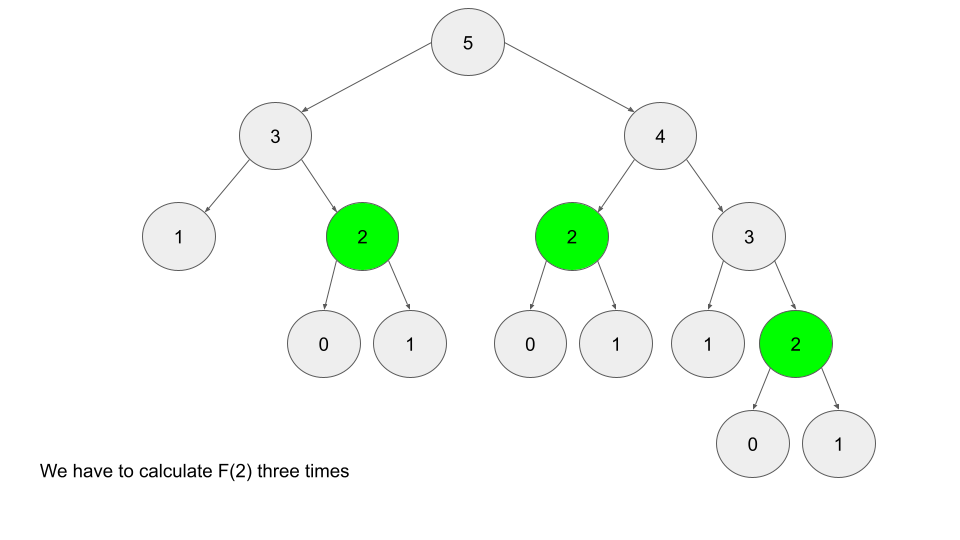

Notice that we need to calculate $F(2)$ three times. This might not seem like a big deal, but if we were to calculate $F(6)$, this **entire image** would be only one child of the root. Imagine if we wanted to find $F(100)$ - the amount of computation is exponential and will quickly explode. The solution to this is to **memoize** results.

> **memoizing** a result means to store the result of a function call, usually in a hashmap or an array, so that when the same function call is made again, we can simply return the **memoized** result instead of recalculating the result.

After we calculate $F(2)$, let's store it somewhere (typically in a hashmap), so in the future, whenever we need to find $F(2)$, we can just refer to the value we already calculated instead of having to go through the entire tree again. Below is an example of what the recursion tree for finding $F(6)$ looks like with and without memoization:

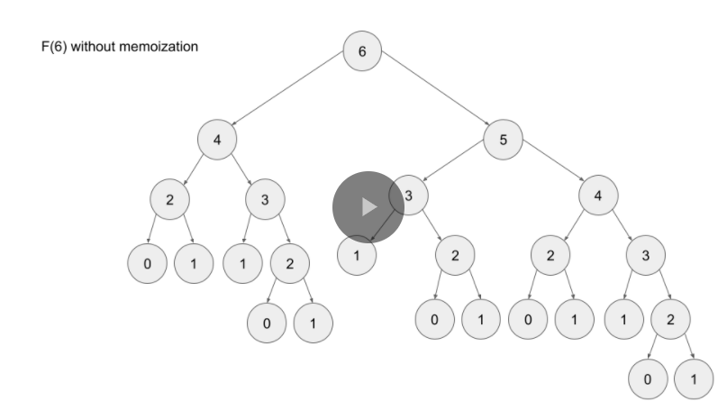
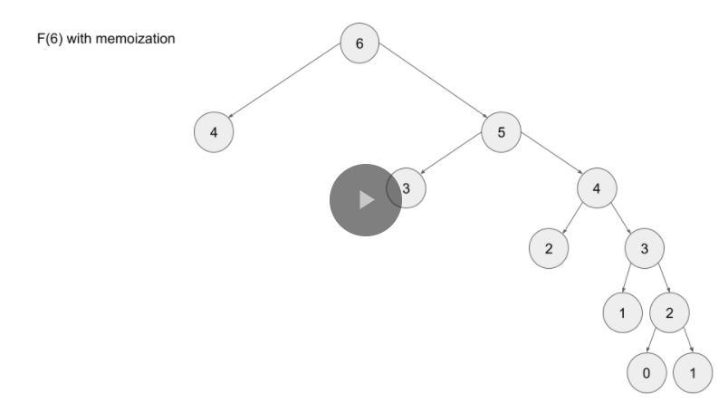

```
// Pseudocode example for top-down

memo = hashmap
Function F(integer i):
    if i is 0 or 1:
        return i
    if i doesn't exist in memo:
        memo[i] = F(i - 1) + F(i - 2)
    return memo[i]
```

#### Which is better?

Any DP algorithm can be implemented with either method, and there are reasons for choosing either over the other. However, each method has one main advantage that stands out:

- A bottom-up implementation's runtime is usually faster, as iteration does not have the overhead that recursion does.
- A top-down implementation is usually much easier to write. This is because with recursion, the ordering of subproblems does not matter, whereas with tabulation, we need to go through a logical ordering of solving subproblems.

> We'll be talking more about these two options throughout the card. For now, all you need to know is that top-down uses recursion, and bottom-up uses iteration.

### When to Use DP

When it comes to solving an algorithm problem, especially in a high-pressure scenario such as an interview, half the battle is figuring out how to even approach the problem. In the first section, we defined what makes a problem a good candidate for dynamic programming. Recall:

1. The problem can be broken down into "overlapping subproblems" - smaller versions of the original problem that are re-used multiple times
2. The problem has an "optimal substructure" - an optimal solution can be formed from optimal solutions to the overlapping subproblems of the original problem

Unfortunately, it is hard to identify when a problem fits into these definitions. Instead, let's discuss some common characteristics of DP problems that are easy to identify.

**The first characteristic** that is common in DP problems is that the problem will ask for the optimum value (maximum or minimum) of something, or the number of ways there are to do something. For example:

- What is the minimum cost of doing...
- What is the maximum profit from...
- How many ways are there to do...
- What is the longest possible...
- Is it possible to reach a certain point...

> **Note:** Not all DP problems follow this format, and not all problems that follow these formats should be solved using DP. However, these formats are very common for DP problems and are generally a hint that you should consider using dynamic programming.

When it comes to identifying if a problem should be solved with DP, this first characteristic is not sufficient. Sometimes, a problem in this format (asking for the max/min/longest etc.) is meant to be solved with a greedy algorithm. The next characteristic will help us determine whether a problem should be solved using a greedy algorithm or dynamic programming.

**The second characteristic** that is common in DP problems is that future "decisions" depend on earlier decisions. Deciding to do something at one step may affect the ability to do something in a later step. This characteristic is what makes a greedy algorithm invalid for a DP problem - we need to factor in results from previous decisions. Admittedly, this characteristic is not as well defined as the first one, and the best way to identify it is to go through some examples.

 is an excellent example of a dynamic programming problem. The problem description is:

> You are a professional robber planning to rob houses along a street. Each house has a certain amount of money stashed, the only constraint stopping you from robbing each of them is that adjacent houses have security systems connected and it will automatically contact the police if two adjacent houses were broken into on the same night.
>
> Given an integer array nums representing the amount of money of each house, return the maximum amount of money you can rob tonight without alerting the police.

In this problem, each decision will affect what options are available to the robber in the future. For example, with the test case $nums = [2, 7, 9, 3, 1]$, the optimal solution is to rob the houses with $2$, $9$, and $1$ money. However, if we were to iterate from left to right in a greedy manner, our first decision would be whether to rob the first or second house. $7$ is way more money than $2$, so if we were greedy, we would choose to rob house $7$. However, this prevents us from robbing the house with 9 money. As you can see, our decision between robbing the first or second house affects which options are available for future decisions.

 is another example of a classic dynamic programming problem. In this problem, we need to determine the length of the longest (first characteristic) subsequence that is strictly increasing. For example, if we had the input $nums = [1, 2, 6, 3, 5]$, the answer would be $4$, from the subsequence $[1, 2, 3, 5]$. Again, the important decision comes when we arrive at the $6$ - do we take it or not take it? If we decide to take it, then we get to increase our current length by $1$, but it affects the future - we can no longer take the $3$ or $5$. Of course, with such a small example, it's easy to see why we shouldn't take it - but how are we supposed to design an algorithm that can always make the correct decision with huge inputs? Imagine if nums contained $10,000$ numbers instead.

> When you're solving a problem on your own and trying to decide if the second characteristic is applicable, assume it isn't, then try to think of a counterexample that proves a greedy algorithm won't work. If you can think of an example where earlier decisions affect future decisions, then DP is applicable.

To summarize: if a problem is asking for the maximum/minimum/longest/shortest of something, the number of ways to do something, or if it is possible to reach a certain point, it is probably greedy or DP. With time and practice, it will become easier to identify which is the better approach for a given problem. Although, in general, if the problem has constraints that cause decisions to affect other decisions, such as using one element prevents the usage of other elements, then we should consider using dynamic programming to solve the problem. **These two characteristics can be used to identify if a problem should be solved with DP.**

> Note: these characteristics should only be used as guidelines - while they are extremely common in DP problems, at the end of the day DP is a very broad topic.

## Strategic Approach to DP

### Framework for DP Problems

Now that we understand the basics of DP and how to spot when DP is applicable to a problem, we've reached the most important part: actually solving the problem. In this section, we're going to talk about a framework for solving DP problems. This framework is applicable to nearly every DP problem and provides a clear step-by-step approach to developing DP algorithms.

> For this article's explanation, we're going to use the problem  as an example, with a top-down (recursive) implementation. Take a moment to read the problem description and understand what the problem is asking.

Before we start, we need to first define a term: **state**. In a DP problem, a **state** is a set of variables that can sufficiently describe a scenario. These variables are called **state variables**, and we only care about relevant ones. For example, to describe every scenario in Climbing Stairs, there is only 1 relevant state variable, the current step we are on. We can denote this with an integer $i$. If $i = 6$, that means that we are describing the state of being on the 6th step. Every unique value of $i$ represents a unique **state**.

> You might be wondering what "relevant" means here. Picture this problem in real life: you are on a set of stairs, and you want to know how many ways there are to climb to say, the 10th step. We're definitely interested in what step you're currently standing on. However, we aren't interested in what color your socks are. You could certainly include sock color as a state variable. Standing on the 8th step wearing green socks is a different state than standing on the 8th step wearing red socks. However, changing the color of your socks will not change the number of ways to reach the 10th step from your current position. Thus the color of your socks is an **irrelevant** variable. In terms of figuring out how many ways there are to climb the set of stairs, the only **relevant** variable is what stair you are currently on.

#### The Framework

To solve a DP problem, we need to combine 3 things:

1. **A function or data structure that will compute/contain the answer to the problem for every given state.**

For Climbing Stairs, let's say we have an function $dp$ where $dp(i)$ returns the number of ways to climb to the $i^{th}$ step. Solving the original problem would be as easy as $return dp(n)$.

How did we decide on the design of the function? The problem is asking "How many distinct ways can you climb to the top?", so we decide that the function will represent how many distinct ways you can climb to a certain step - literally the original problem, but generalized for a given state.

Typically, top-down is implemented with a recursive function and hash map, whereas bottom-up is implemented with nested for loops and an array. When designing this function or array, we also need to decide on state variables to pass as arguments. This problem is very simple, so all we need to describe a state is to know what step we are currently on $i$. We'll see later that other problems have more complex states.

2. A recurrence relation to transition between states.

A recurrence relation is an equation that relates different states with each other. Let's say that we needed to find how many ways we can climb to the 30th stair. Well, the problem states that we are allowed to take either 1 or 2 steps at a time. Logically, that means to climb to the 30th stair, we arrived from either the 28th or 29th stair. Therefore, the number of ways we can climb to the 30th stair is equal to the number of ways we can climb to the 28th stair plus the number of ways we can climb to the 29th stair.

The problem is, we don't know how many ways there are to climb to the 28th or 29th stair. However, we can use the logic from above to define a recurrence relation. In this case, $dp(i) = dp(i - 1) + dp(i - 2)$. As you can see, information about some states gives us information about other states.

> Upon careful inspection, we can see that this problem is actually the Fibonacci sequence in disguise! This is a very simple recurrence relation - typically, finding the recurrence relation is the most difficult part of solving a DP problem. We'll see later how some recurrence relations are much more complicated, and talk through how to derive them.

3. Base cases, so that our recurrence relation doesn't go on infinitely.

The equation $dp(i) = dp(i - 1) + dp(i - 2)$ on its known will continue forever to negative infinity. We need base cases so that the function will eventually return an actual number.

Finding the base cases is often the easiest part of solving a DP problem, and just involves a little bit of logical thinking. When coming up with the base case(s) ask yourself: What state(s) can I find the answer to without using dynamic programming? In this example, we can reason that there is only 1 way to climb to the first stair (1 step once), and there are 2 ways to climb to the second stair (1 step twice and 2 steps once). Therefore, our base cases are $dp(1) = 1 and dp(2) = 2$.

> We said above that we don't know how many ways there are to climb to the 28th and 29th stairs. However, using these base cases and the recurrence relation from step 2, we can figure out how many ways there are to climb to the 3rd stair. With that information, we can find out how many ways there are to climb to the 4th stair, and so on. Eventually, we will know how many ways there are to climb to the 28th and 29th stairs.

#### Example Implementations

```python
class Solution:
    def climbStairs(self, n: int) -> int:
        def dp(i):
            """A function that returns the answer to the problem for a given state."""
            # Base cases: when i is less than 3 there are i ways to reach the ith stair.
            if i <= 2:
                return i

            # If i is not a base case, then use the recurrence relation.
            return dp(i - 1) + dp(i - 2)

        return dp(n)
```

Do you notice something missing from the code? We haven't memoized anything! The code above has a time complexity of $O\lparen{2^n}\rparen$ because every call to dp creates 2 more calls to $dp$. If we wanted to find how many ways there are to climb to the 250th step, the number of operations we would have to do is approximately equal to the number of atoms in the universe.

In fact, without the memoization, this isn't actually dynamic programming - it's just basic recursion. Only after we optimize our solution by adding memoization to avoid repeated computations can it be called DP. As explained in chapter 1, memoization means caching results from function calls and then referring to those results in the future instead of recalculating them. This is usually done with a hashmap or an array.

```python
class Solution:
    def climbStairs(self, n: int) -> int:
        def dp(i):
            if i <= 2:
                return i
            if i not in memo:
                # Instead of just returning dp(i - 1) + dp(i - 2), calculate it once and then
                # store the result inside a hashmap to refer to in the future.
                memo[i] = dp(i - 1) + dp(i - 2)

            return memo[i]

        memo = {}
        return dp(n)
```

With memoization, our time complexity drops to $\text{O(n)}$ - astronomically better, literally.

> You may notice that a hashmap is overkill for caching here, and an array can be used instead. This is true, but using a hashmap isn't necessarily bad practice as some DP problems will require one, and they're hassle-free to use as you don't need to worry about sizing an array correctly. Furthermore, when using top-down DP, some problems do not require us to solve every single subproblem, in which case an array may use more memory than a hashmap.

We just talked a whole lot about top-down, but what about bottom-up? Everything is pretty much the same, except we will start from our base cases and iterate up to our final answer. As stated before, bottom-up implementations usually use an array, so we will use an array $\text{dp}$ where $\text{dp[i]}$ represents the number of ways to climb to the $i^{th}$ step.

```python
class Solution:
    def climbStairs(self, n: int) -> int:
        if n == 1:
            return 1

        # An array that represents the answer to the problem for a given state
        dp = [0] * (n + 1)
        dp[1] = 1 # Base cases
        dp[2] = 2 # Base cases

        for i in range(3, n + 1):
            dp[i] = dp[i - 1] + dp[i - 2] # Recurrence relation

        return dp[n]
```

> Notice that the implementation still follows the framework exactly - the framework holds for both top-down and bottom-up implementations.

#### To Summarize

With DP problems, we can use logical thinking to find the answer to the original problem for certain inputs, in this case we reason that there is 1 way to climb to the first stair and 2 ways to climb to the second stair. We can then use a recurrence relation to find the answer to the original problem for any state, in this case for any stair number. Finding the recurrence relation involves thinking about how moving from one state to another changes the answer to the problem.

This is the essence of dynamic programming. Here's a quick animation for Climbing Stairs:

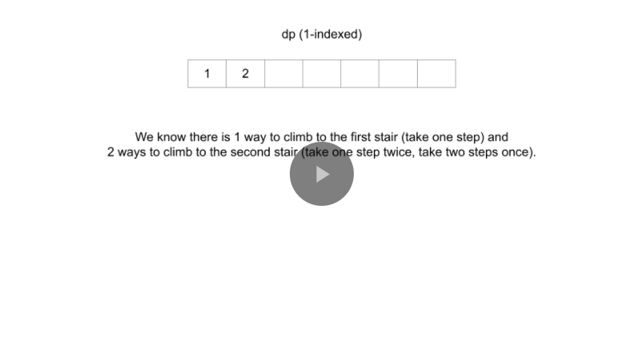
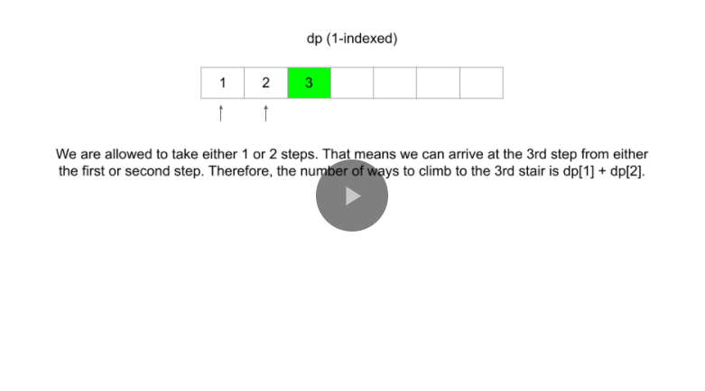
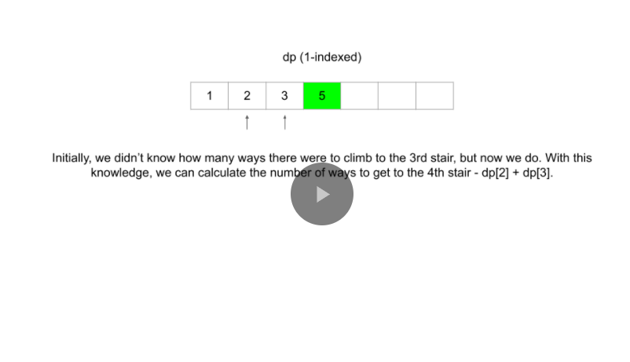
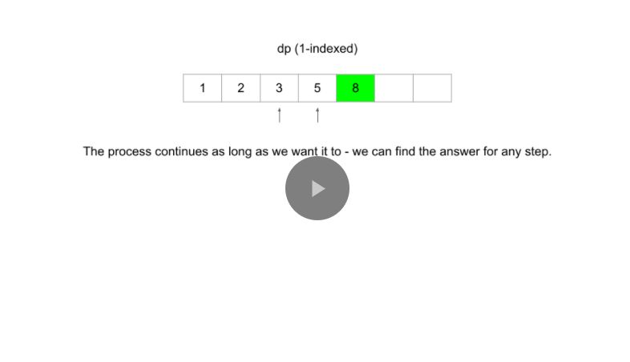
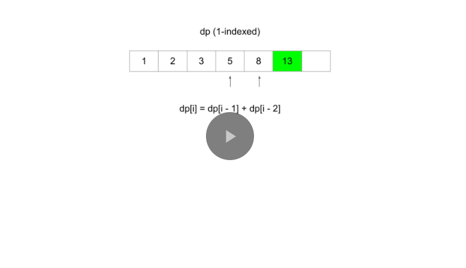
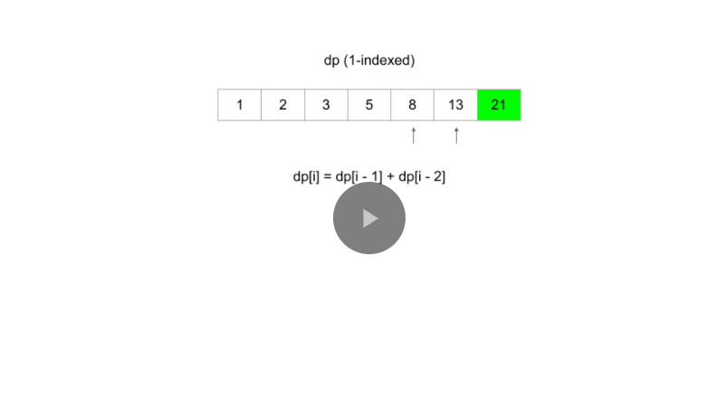

#### Next Up

For the rest of the explore card, we're going to use the framework to solve multiple examples, while explaining the thought process behind how to apply the framework at each step. It may be useful to refer back to the section of this article titled "The framework" as you move along the card. For now, take a deep breath - this was a lot to take in, but soon you will be equipped to start solving DP problems on your own.

### Example 198. House Robber

> This is the first of 6 articles where we will use a framework to work through example DP problems. The framework provides a blueprint to solve DP problems, but when you are just starting to learn DP, deriving some of the logic yourself may be difficult. The objective of these articles is to talk through how to use the framework to work through each problem, and our goal is that, by the end of this, you will be able to independently tackle most DP problems using this framework.

In this article, we will be looking at the [House Robber](https://leetcode.com/problems/house-robber/) problem. In an earlier section of this explore card, we talked about how House Robber fits the characteristics of a DP problem. It's asking for the maximum of something, and our current decisions will affect which options are available for our future decisions. Let's see how we can use the framework to develop an algorithm for this problem.

1. A **function or array** that answers the problem for a given state

First, we need to decide on state variables. As a reminder, state variables should be fully capable of describing a scenario. Imagine if you had this scenario in real life - you're a robber and you have a lineup of houses. If you are at one of the houses, the only variable you would need to describe your situation is an integer - the index of the house you are currently at. Therefore, the only state variable is an integer, say \text{i}i, that indicates the index of a house.

> If the problem had an added constraint such as "you are only allowed to rob up to k houses", then $k$ would be another necessary state variable. This is because being at, say house 4 with 3 robberies left is different than being at house 4 with 5 robberies left.
>
> You may be wondering - why don't we include a state variable that is a boolean indicating if we robbed the previous house or not? We certainly could include this state variable, but we can develop our recurrence relation in a way that makes it unnecessary. Building an intuition for this is difficult at first, but it becomes easier with practice.

The problem is asking for "the maximum amount of money you can rob". Therefore, we would use either a function $\text{dp(i)}$ that returns the maximum amount of money you can rob up to and including house $\text{i}$, or an array $\text{dp}$ where $\text{dp[i]}$ represents the maximum amount of money you can rob up to and including house $\text{i}$.

This means that after all the subproblems have been solved, $\text{dp[i]}$ and $\text{dp(i)}$ both return the answer to the original problem for the subarray of $\text{nums}$ that spans 00 to $\text{i}$ inclusive. To solve the original problem, we will just need to return $\text{dp[nums.length - 1]}$ or $\text{dp(nums.length - 1)}$, depending if we do bottom-up or top-down.

2. A **recurrence relation** to transition between states

> For this part, let's assume we are using a top-down (recursive function) approach. Note that the top-down approach is closer to our natural way of thinking and it is generally easier to think of the recurrence relation if we start with a top-down approach.

Next, we need to find a recurrence relation, which is typically the hardest part of the problem. For any recurrence relation, a good place to start is to think about a general state (in this case, let's say we're at the house at index $\text{i}$), and use information from the problem description to think about how other states relate to the current one.

If we are at some house, logically, we have 2 options: we can choose to rob this house, or we can choose to not rob this house.

1. If we decide not to rob the house, then we don't gain any money. Whatever money we had from the previous house is how much money we will have at this house - which is $\text{dp(i - 1)}$.
2. If we decide to rob the house, then we gain $\text{nums[i]}$ money. However, this is only possible if we did not rob the previous house. This means the money we had when arriving at this house is the money we had from the previous house without robbing it, which would be however much money we had 2 houses ago, $\text{dp(i - 2)}$. After robbing the current house, we will have $\text{dp(i - 2) + nums[i]}$ money.

From these two options, we always want to pick the one that gives us maximum profits. Putting it together, we have our recurrence relation: $\text{dp(i)} = \max(\text{dp(i - 1), dp(i - 2) + nums[i]})$.

3. Base cases

The last thing we need is base cases so that our recurrence relation knows when to stop. The base cases are often found from clues in the problem description or found using logical thinking. In this problem, if there is only one house, then the most money we can make is by robbing the house (the alternative is to not rob the house). If there are only two houses, then the most money we can make is by robbing the house with more money (since we have to choose between them). Therefore, our base cases are:

1. $\text{dp(0) = nums[0]}$
2. $\text{dp(1)} = \max( \text{nums[0], nums[1]})$

#### Top-down Implementation

Now that we have established all 3 parts of the framework, let's put it together for the final result. Remember: we need to memoize the function!

```python
class Solution:
    def rob(self, nums: List[int]) -> int:
        def dp(i):
            # Base cases
            if i == 0:
                return nums[0]
            if i == 1:
                return max(nums[0], nums[1])
            if i not in memo:
                memo[i] = max(dp(i - 1), dp(i - 2) + nums[i]) # Recurrence relation
            return memo[i]

        memo = {}
        return dp(len(nums) - 1)
```

#### Bottom-up Implementation

Here's the bottom-up approach: everything is the same, except that we use an array instead of a hash map and we iterate using a for-loop instead of using recursion.

```python
class Solution:
    def rob(self, nums: List[int]) -> int:
        if len(nums) == 1:
            return nums[0]

        dp = [0] * len(nums)

        # Base cases
        dp[0] = nums[0]
        dp[1] = max(nums[0], nums[1])

        for i in range(2, len(nums)):
            dp[i] = max(dp[i - 1], dp[i - 2] + nums[i]) # Recurrence relation

        return dp[-1]
```

For both implementations, the time and space complexity is $O(n)$. We'll talk about time and space complexity of DP algorithms in depth at the end of this chapter. Here's an animation that shows the algorithm in action:

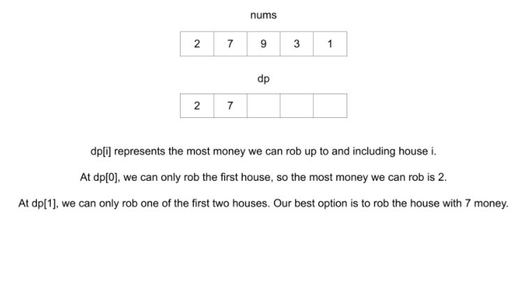
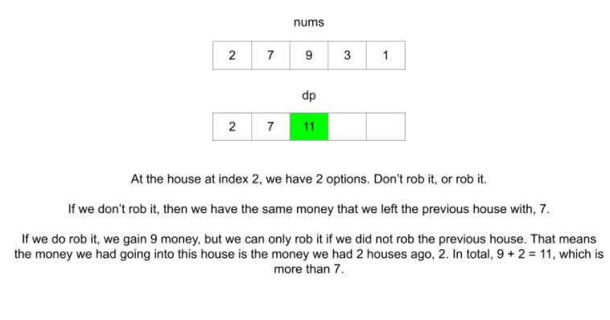
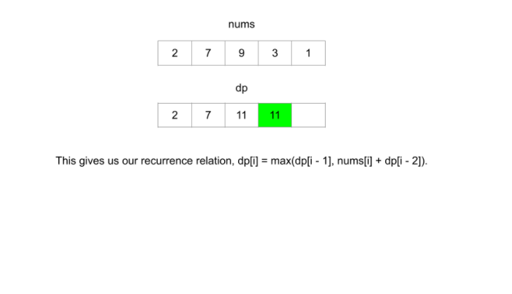
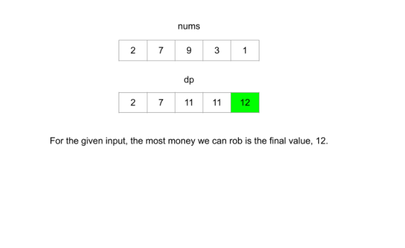

#### Up Next

Now that you've seen the framework in action, try solving these problems (located on the next 2 pages) on your own. If you get stuck, come back here for hints:

**746. Min Cost Climbing Stairs**

**Hints**

- Let $\text{dp(i)}$ be the minimum cost necessary to reach step $\text{i}$.
- We can arrive at step $\text{i}$ from either step $\text{i - 1}$ or step $\text{i - 2}$. Choose whichever one is cheaper.
- Since we can start from either step 0 or step 1, the cost to reach these steps is 0.

**1137. N-th Tribonacci Number**

**Hints**

- Let $\text{dp(i)}$ represent the $i^{th}$ tribonacci number.
- Use the equation given in the problem description.
- Use the base cases given in the problem description.

**740. Delete and Earn**

**Hints**

- Sort $\text{nums}$ and count how many times each number occurs in $\text{nums}$.
- Let $\text{dp(i)}$ be the maximum number of points you can earn between $\text{i}$ and the end of the sorted $\text{nums}$ array.
- When we are at index $\text{i}$ we have 2 options:
  1. Take all numbers that match $\text{nums[i]}$ and skip all $\text{nums[i] + 1}$.
  2. Do not take $\text{nums[i]}$ and move to the first occurrence of $\text{nums[i] + 1}$.    

    Choose whichever option yields the most points.

**Bonus Hint:** When is the first option guaranteed to be better than the second option?

- If we have reached the end of the $\text{nums}nums array \text{(i = nums.length)}$ then return $0$ because we cannot gain any more points.
