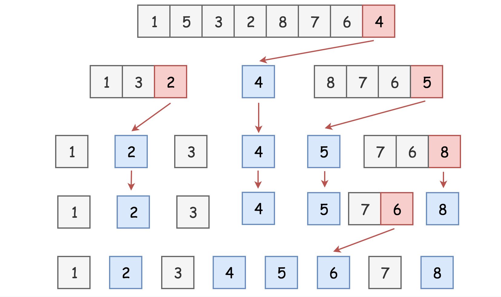

# Quick Sort

In the previous articles, we explained the merge sort algorithm, which is a classical example of the divide-and-conquer algorithm. As a comparison to merge sort algorithm, in this article, we will present you another well-known sorting algorithm called quick sort.

Quick sort [1] is another classical divide-and-conquer algorithm for sorting, which was developed by the British computer scientist Tony Hoare in 1959. When implemented well, quick sort algorithm can be two or three times faster than its predecessors and competitors such as merge sort, which is why it gains its name. 

[LeetCode Link](https://leetcode.com/explore/learn/card/recursion-ii/470/divide-and-conquer/2871/)

## Intuition

Following the [pseudocode template](https://leetcode.com/explore/learn/card/recursion-ii/470/divide-and-conquer/2869/) of the divide-and-conquer algorithm, as we presented before, the quick sort algorithm can be implemented in three steps, namely **dividing the problem, solving the subproblems** and **combining the results of subproblems**.

In detail, given a list of values to sort, the quick sort algorithm works in the following steps:

1. First, it selects a value from the list, which serves as a **_pivot_** value to divide the list into two sublists. One sublist contains all the values that are less than the pivot value, while the other sublist contains the values that are greater than or equal to the pivot value. This process is also called **_partitioning_**. The strategy of choosing a pivot value can vary. Typically, one can choose the first element n the list as the pivot, or randomly pick an element from the list.
2. After the partitioning process, the original list is then reduced into two smaller sublists. We then **_recursively_** sort the two sublists.
3. After the partitioning process, we are sure that all elements in one sublist are less or equal than any element in another sublist. Therefore, we can simply **_concatenate_** the two sorted sublists that we obtain in step [2] to obtain the final sorted list. 

The base cases of the recursion in step [2] are either when the input list is empty or the empty list contains only a single element. In either case, the input list can be considered as sorted already.

As one can see, the essential idea of the quick sort algorithm is the partitioning process, which elegantly reduces the problems into smaller scale and meanwhile moves towards the final solution, i.e. after each partitioning, the overall values become more ordered.

## Algorithm

In the following figure, we demonstrate how the quick sort algorithm works to sort a list of integer values. The input list contains 8 elements.


Fig.1 Quick Sort Illustration (elements in color are pivots)

As shown above, in the first round of quick sort, we pick the last element `4` as the pivot, which partitions the original list into two sublists: `[1, 3, 2]` and `[8, 7, 6, 5]` respectively.

Next, we recursively sort the above two sublists. For instance, for the sublist `[1, 3, 2]`, again we pick the last element (i.e. `2`) as the pivot value. After this partitioning, we obtain two sublists with a single element, which is the base case of the recursion.

Once we sorted the sublists `[1, 3, 2]` and `[8, 7, 6, 5]` respectively, we simply concatenate the sorted results together with the pivot value (`4`) to form the final result, i.e. `[1, 2, 3] + [4] + [5, 6, 7, 8]`.

## Implemenation

Here is the sample implementation of the quick sort algorithm.

```python
def quicksort(lst):
    """
    Sorts an array in the ascending order in O(n log n) time
    :param nums: a list of numbers
    :return: the sorted list
    """
    n = len(lst)
    qsort(lst, 0, n - 1)

def qsort(lst, lo, hi):
    """
    Helper
    :param lst: the list to sort
    :param lo:  the index of the first element in the list
    :param hi:  the index of the last element in the list
    :return: the sorted list
    """
    if lo < hi:
        p = partition(lst, lo, hi)
        qsort(lst, lo, p - 1)
        qsort(lst, p + 1, hi)

def partition(lst, lo, hi):
    """
    Picks the last element hi as a pivot
     and returns the index of pivot value in the sorted array
    """
    pivot = lst[hi]
    i = lo
    for j in range(lo, hi):
        if lst[j] < pivot:
            lst[i], lst[j] = lst[j], lst[i]
            i += 1
    lst[i], lst[hi] = lst[hi], lst[i]
    return i
```

## Complexity

Depending on the pivot values, the time complexity of the quick sort algorithm can vary from O(N log_2(N)) in the best case and O(N^2) in the worst case, with {N} as the length of the list.

In the best case, if the pivot value happens to be median value of the list, then at each partition the list would be divided into two sublists of equal size. At the end, we actually construct a **_balanced_** [binary search tree](https://leetcode.com/explore/learn/card/introduction-to-data-structure-binary-search-tree/) (BST) out of the list. One can infer that the height of the tree would be log_2(N), and at each level of the tree the input list would be scanned once with the complexity O(N) due to the partitioning process. As a result, the overall time complexity of the algorithm in this case would be O(N log_2(N)).

While in the worst case, if the pivot value happens to be the extreme value of the list, i.e. either the smallest or the biggest element in the list, then at each partition we end up with only one single sublist (i.e. the other sublist is empty). The reduction of the problem still works, but at a rather slow pace, i.e. one element at a time. The partitioning would then occur N times, and each time the partitioning scans at most N elements. Therefore, the overall time complexity of the quick sort algorithm in this case would be O(N^2). Actually, in this case, the quick sort algorithm ends up to be exactly as the insertion sort.

On average, as proved mathematically, the time complexity of quick sort is O(NlogN).

## Master Theorem

Other than evaluating the time complexity of recursion algorithms case by case, sometimes you can apply a method called Master Theorem to quickly calculate the time complexity of many recursion algorithms.

> (Master Theorem)[https://en.m.wikipedia.org/wiki/Master_theorem_(analysis_of_algorithms)], also known as Master Method, provides asymptotic analysis (i.e. the time complexity) for many of the recursion algorithms that follow the pattern of divide-and-conquer.

Note that Master Theorem is an _advanced_ technique to estimate the time complexity of certain recursive algorithms. It does _not_ apply to all recursion algorithms. Certainly, one is not expected to memorize by heart all the formulas involved in Master Theorem during the interviews.

```c++
 function dac( n ):
   if n < k:  // k: some constant
     Solve "n" directly without recursion
   else:
     [1]. divide the problem "n" into "b" subproblems of equal size.
       - then the size of each subproblem would be "n/b"
     [2]. call the function "dac()" recursively "a" times on the subproblems
     [3]. combine the results from the subproblems
```

For the recursion algorithms that follow the above pattern, one can apply the master theorem to calculate their time complexity. 

If we define the time complexity of the above recursion algorithm as T(n), then we can express it as follows:

T(n) = a * T(n/b) + f(n)

where f(n) is the time complexity that it takes to divide the problems into subproblems and also to combine the results from the subproblems. We can further represent f(n) as O(n^d) and d ≥ 0.  

Then, Master Theorem provides us three formulas to calculate the time complexity of the recursion algorithm, according to the relationship among {a, b, d}a,b,d. They are stated as follows:

1. if a > b^d i.e. d < log_b(a) = log_2(a) / log_2(b), then T(n)  = O(n^(log_b(a)));
2. if a = b^d i.e. d = log_b(a)  = log_2(a) / log_2(b), then T(n) = O(n^d * log(n)) = O(n^(log_b(a)) * log(n));
3. if a < b^d i.e. d > log_b(a) = log_2(a) / log_2(b), then T(n) = O(n^d)

> The conditions for each case correspond to the intuition of whether the work to split problems and combine results (i.e. f(n)) outweighs the work of subproblems (i.e. a⋅T(n/b)).

## Examples

### Case 1:

Binary tree traversal related algorithms are the algorithms where one needs to traverse a binary tree in order to solve the problem. Often you can apply a strategy named Depth-First Search (DFS) to traverse the binary tree, which can be implemented as a recursion algorithm and fits the pattern as we described above. Here is one example, Maximum Depth of Binary Tree, where you have to find the maximum depth for a given binary tree.

In a DFS recursion algorithm, first we divide the problem into two halves at each recursion, i.e. left child and right child, then we make a recursion call for each of the two subproblems, and finally, we combine the results from the two recursion calls.

According to the pattern that we describe at the beginning of the article, for DFS recursion algorithms, we then can figure out the values for the parameters in Master Theorem,  i.e. b=2 (problem divided into halves), a=2 (both subproblems needed to be solved), and f(n)=O(1) therefore d=0. In particular, the reason behind f(n)=O(1) is twofold: 1). The effort to split the problems in DFS is constant, since the input is already organized as a collection of subproblems, i.e. children subtrees. 2). The effort to combine the results from the recursion calls is also constant.  

As a result, by applying the Master Theorem, we can obtain the time complexity of DFS recursion algorithm, as follows:

Since a = 2, b = 2, d = 0, so d < log_b(a) _i.e._ 0 < log_2(2) = 1, therefore T(n) = O(n^(log_b(a)) = O(n)

As many of you know, the time complexity for DFS recursion algorithm is indeed O(n), since we visit each node in the tree one by one during DFS, which is consistent with the complexity estimation obtained by applying the Master Theorem.

 
### Case 2:

> T(n)=O(n^d * log(n)) = O(n^(log_b(a)) * log(n))

[Binary search](https://en.m.wikipedia.org/wiki/Binary_search_algorithm), is a search algorithm that finds the position of the target value in a sorted array. The algorithm would divide the size of the problem into halves at each iteration, and then focus on one of the halves subproblems. One can find a similar problem here.

According to the pattern, for binary search algorithm, we can figure out the values for the parameters in Master Theorem, i.e. b=2 (problem divided into halves), a=1 (only one of the subproblems needed to be solved), and f(n)=O(1) therefore d=0. The reason why f(n)=O(1) is twofold: 1). The effort to split the problem into halves could be constant, since the given input is a sorted array and one can refer to a range of elements simply by index without iterating through the array; 2). The effort to combine the results of subproblems is constant as well in this case, since we can simply return the result of subproblem without any further processing.

As a result, by applying the Master Theorem, we can obtain the time complexity of binary search algorithm, as follows:

Since a = 1, b = 2, d = 0, so d = log_b(a) _i.e._ 0 = log_2(1), therefore T(n) = O(n^d * log(n)) = O(log(n))

As many of you know, the time complexity of binary search algorithm is indeed O(logn). Once again, the result complies with the Master Theorem.

Another example that falls into this category, is called [merge sort](https://en.m.wikipedia.org/wiki/Merge_sort), whose time complexity is O(nlogn).

 
### Case 3

> T(n)=O(n^d)

This case is a bit tricky. Here, the efforts of dividing problems and aggregating results overweight the efforts of solving subproblems.

One of the examples that fall into this case would be the [quickselect](https://en.wikipedia.org/wiki/Quickselect), which is an algorithm that selects the kth largest/smallest element in an unsorted list (one can also find [the problem here](https://leetcode.com/problems/kth-largest-element-in-an-array/)). Similar to the binary search algorithm, quickselect algorithm partitions the input list with certain pivot, which eventually reduces the problem into a smaller scale.

Let's assume that each time the algorithm partitions the input into halves exactly, i.e. the chosen pivot is the median of the input, so its complexity can be expressed with the Master Theorem as T(n)=T(n/2)+O(n), where a=1 since we only need to look into one of the partitions and b=2 since the input is divided into halves, and finally d=1 since it takes O(n) complexity to partition the input each time. As a result, d = 1 > log_2(1), it falls into the **case 3** of the Master Theorem. The case where the chosen pivot is the median of the input can be considered as the average case for the quickselect algorithm, which usually selects the pivot by random. Therefore, the expected time complexity of quickselect is O(n^d)=O(n), by applying the Master Theorem. 

> Other cases, where the sizes of subproblems are different. 

Master Theorem has its limitations though, since it only applies to the cases where the subproblems are of equal size. Now as it might come to your mind, we cannot apply the Master Theorem to the recursion algorithm for our Fibonacci number. As a reminder, here is the recurrence relation for Fibonacci number: F(n)=F(n−1)+F(n−2), where the problem is divided into two subproblems of different size.

In this case, to estimate the time complexity, we can resort to the [Akra-Bazzi Theorem](https://en.m.wikipedia.org/wiki/Akra%E2%80%93Bazzi_method), also known as Akra-Bazzi method, which is a generalization of Master Theorem in order to deal with cases where subproblems are of different size.
