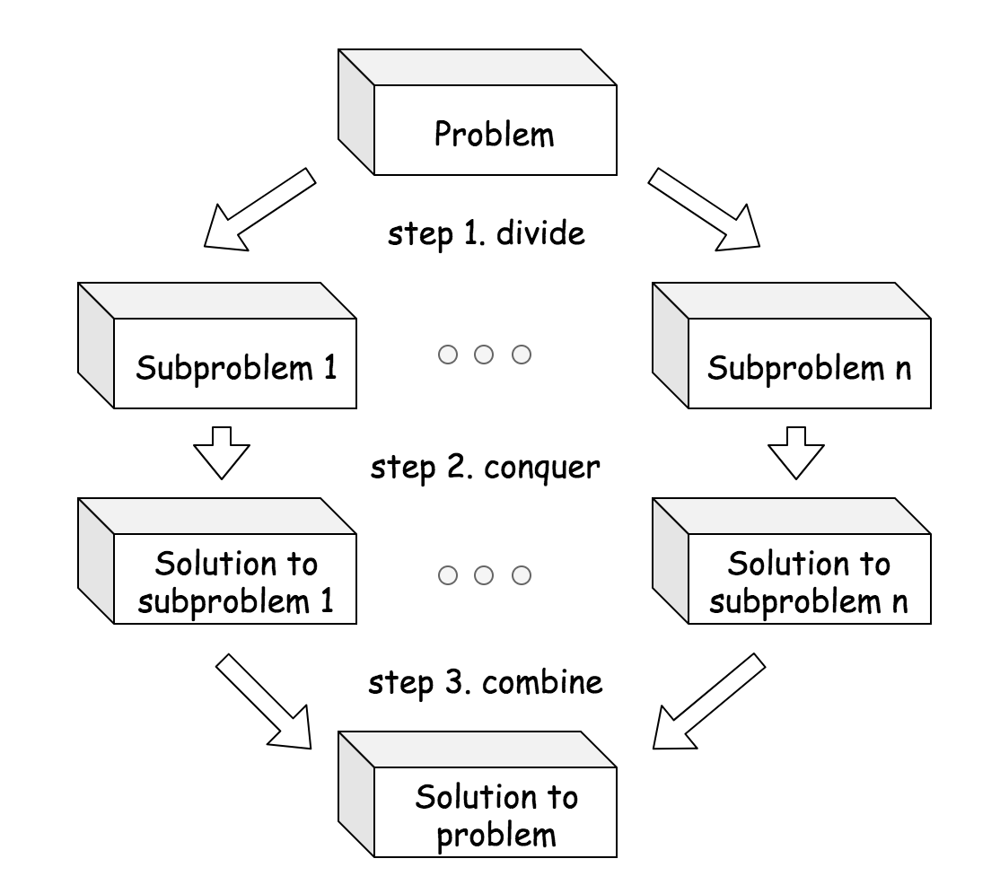

# Recursion II

In this card, we introduced the paradigms of divide-and-conquer and backtracking, which often implemented in the form of recursion. Each of the paradigms is well suited for certain types of problems. In this article, we give a brief summary of these paradigms and highlight their differences. 

In the rest of the chapter, we list a few more exercises for one to practice these paradigms. If you have any doubt or question, you can always make a post in the Forum that is located at the end of the card. We will try our best to get back to you as soon as possible.

## Divide and Conquer

> A divide-and-conquer algorithm works by recursively breaking the problem down into two or more subproblems of the same or related type, until these subproblems become simple enough to be solved directly [[1]](http://en.wikipedia.org/wiki/Divide-and-conquer_algorithm). Then one combines the results of subproblems to form the final solution.

## Backtracking

> Backtracking is a general algorithm for finding all (or some) solutions to some computational problems (notably constraint satisfaction problems), which incrementally builds candidates to the solution and abandons a candidate ("backtracks") as soon as it determines that the candidate cannot leads to a valid solution.[[2]](https://en.wikipedia.org/wiki/Backtracking)

## Divide and Conquer VS. Backtracking

1. Often the case, the divide-and-conquer problem has a sole solution, while the backtracking problem has unknown number of solutions. For example, when we apply the merge sort algorithm to sort a list, we obtain a single sorted list, while there are many solutions to place the queens for the N-queen problem.

2. Each step in the divide-and-conquer problem is indispensable to build the final solution, while many steps in backtracking problem might not be useful to build the solution, but serve as atttempts to search for the potential solutions. For example, each step in the merge sort algorithm, i.e. divide, conquer and combine, are all indispensable to build the final solution, while there are many trials and errors during the process of building solutions for the N-queen problem.

3. When building the solution in the divide-and-conquer algorithm, we have a clear and predefined path, though there might be several different manners to build the path. While in the backtracking problems, one does not know in advance the exact path to the solution. For example, in the top-down merge sort algorithm, we first recursively divide the problems into two subproblems and then combine the solutions of these subproblems. The steps are clearly defined and the number of steps is fixed as well. While in the N-queen problem, if we know exactly where to place the queens, it would only take N steps to do so. When applying the backtracking algorithm to the N-queen problem, we try many candidates and many of them do not eventually lead to a solution but abandoned at the end. As a result, we do not know beforehand how many steps exactly it would take to build a valid solution.

